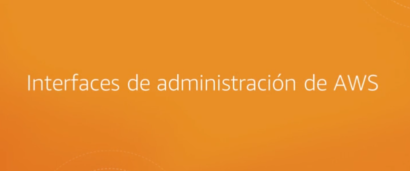
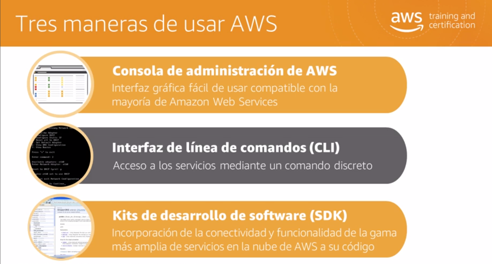
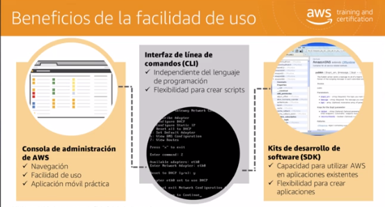
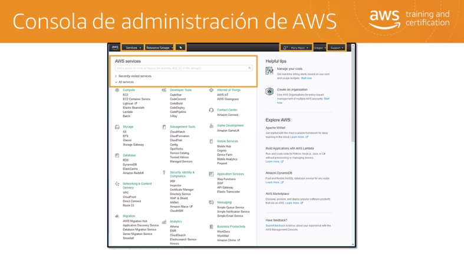
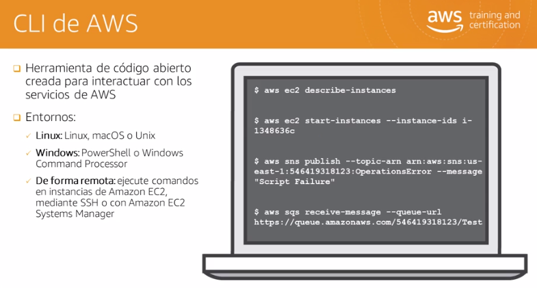
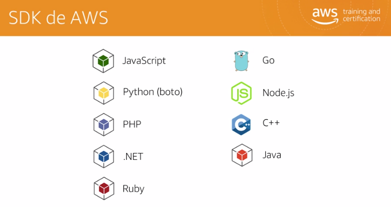

# Módulo 1 - Introducción a las Interfaces de AWS

Bienvenido a las interfaces de administración de AWS. En este modulo, conocerás las opciones practicas para obtener acceso a los recursos de AWS y utilizarlos.

Los usuarios de AWS pueden crear y administrar recursos de tres formas únicas: mediante la consola de administración de AWS, mediante la interfaz de linea de comandos de AWS (también denominada "CLI de AWS"), o con los kits de desarrollo de software (o SDK) de AWS. Las tres opciones se basan en una interfaz común, o API, que sirve de base para AWS.

1. La consola de administración de AWS proporciona una interfaz grafica para obtener acceso a las características de AWS
2. La CLI de AWS le permite controlar los servicios de AWS desde linea de comandos
3. AWS también proporciona SDK que le permite obtener acceso a AWS mediante diversos lenguajes de programación populares

Ahora, antes de explorar cómo utilizar estas opciones, repasemos brevemente las herramientas.

- La consola de administrador de AWS le permite abrir y utilizar diversos servicios y características de AWS. Incluso hay una aplicación que puede utilizar con plataformas IOS o Andorid para ver sus recursos y alarmas existentes y realizar tareas operativas cuando lo desee.
- La CLI de AWS le permitirá automatizar y repetir la implementación de recursos de AWS de manera independiente del lenguaje de programación.
- Cuando los SDK pueden ayudarlo a utilizar AWS en sus aplicaciones existentes, cree aplicaciones existentes que puedan implementar y monitorear sistemas complejos solo con código. La CLI de AWS y los SDK le ofrecen la flexibilidad necesaria para personalizar las características de AWS y crear sus propias herramientas especificas para su negocio.
- Puede utilizar los tres modos de forma indistinta, no son exclusivos. Por ejemplo, puede crear una instancia de Amazon EC2 mediante una llamada al SDK, luego, describirla con la CLI de AWS y cerrarla mas adelante con apenas unos clic's en la consola.

Ahora vamos a examinar cada herramienta.

----
- **Consola de Administración AWS**

- La consola facilitara la administración en la nube para todos los aspectos de su cuenta AWS, incluido el monitoreo del gasto mensual, la administración de credenciales de seguridad y la configuración de nuevos usuarios.
- Le ofrecerá varias formas de encontrar y abrir servicios. En la página de inicio de la consola, puede buscar lo que necesita, seleccionar los servicios visitados recientemente o ampliar la sección **"All Services"** (Todos los servicios) para examinar todos los servicios de AWS. La opción **Services** (Servicios), siempre se muestra en la barra de navegación superior, lo que le permite buscar lo que necesita en cualquier momento, enumerar servicios por grupos u organizarlos alfabéticamente.
- Puede personalizar su experiencia en la consola mediante la creación de accesos directos a los servicios que visita con mayor frecuencia. El icono de pin le permitirá arrastrar y soltar enlaces de servicio directamente en la barra de herramientas.
- Puede utilizar **Resource Groups** (Grupos de Recursos) para simplificar el uso de la consola. Puede crear un grupo de recursos para cada aplicación, servicio o colección de recursos relacionados que utilice con frecuencia. Obtenga acceso rápidamente a cada grupo de recursos guardados con el menú **"AWS"**. Los grupos de recursos son específicos de las identidades, por lo que cada usuario de su cuenta puede crear grupos de recursos únicos para sus propios recursos de acceso frecuente y sus tareas comunes. Puede compartir estas definiciones de grupos de recursos con otros usuarios de la misma cuenta mediante una URL.
- **Tag Editor** le permite administrar con facilidad etiquetas para tipos de recursos que admiten etiquetas. Aplique claves de etiqueta y valores a varios recursos a la vez. **Tag Editor** admite la búsqueda de etiquetas globales y la edición masiva, por lo que es fácil encontrar todos los recursos con una etiqueta especial o realizar cambios de etiqueta a través de varios recursos con apenas unos clic's.
- Desde la consola, también puede obtener acceso a recursos útiles para obtener mas información sobre los servicios y las características de AWS y comenzar a crear sus soluciones. La sección **"Build a Solution"** (Crear una solución) incorpora varios asistentes y flujos de trabajo automatizados sencillos que le permiten crear los recursos necesarios para la solución que desee. La sección **"Learm to build"** (Aprender a crear) incluye recursos de aprendizaje organizados por tipo de solución y caso de uso. Los recursos pueden incluir tutoriales, videos, laboratorios autoguiados, guiás de proyectos o documentación de cursos.
- Para obtener acceso a la consola de forma remota mediante su dispositivo, solo tiene que descargar nuestra aplicación desde la APPSTORE de Amazon, Google Play o iTunes.

Cabe destacar que algunos cambios realizados con otra interfaz puede tardar tiempo en actualizarse y mostrarse en la consola. Por ejemplo, si realiza cambios en una característica mediante la CLI, es posible que no se puedan ver con facilidad desde la consola en su lanzamiento inicial.

----
- **CLI AWS**

LA CLI de AWS es una herramienta de código abierto que le permite interactuar con los servicios de AWS sin la necesidad de realizar demasiadas configuraciones. Puede comenzar a utilizar toda la funcionalidad de AWS desde la linea de comandos, incluida la ejecución de comandos para Windows, Linux. macOS o Unix. Aprenderá como hacerlo mas adelante en este curso.

----
- **SDK AWS**

El SDK de AWS y las interfaces compatibles permiten a las aplicaciones creadas en AWS administrar su infraestructura como código. El concepto de Infraestructura como código es potente y disruptivo, y es lo que distingue a la nube del antiguo mundo de TI. Estos SDK específicos de lenguaje contienen API que te permiten incorporar con facilidad la conectividad y la funcionalidad de la gama mas amplia de servicios en la nube de AWS en su código sin la dificultad de escribir las funciones usted mismo.

AWS proporciona numerosos recursos para estos SDK, incluidos los foros y los blogs de la comunidad, las guías de introducción, las guiás para desarrolladores y las referencias de API.

En Resumen, AWS ofrece tres formas diferentes de crear y administrar recursos de AWS en su plataforma: la consola, el CLI de AWS y los SDK. Todas ellas hacen referencia a la API de AWS. Tiene la flexibilidad de crear sus propios recursos y obtener acceso a las características sobre la marcha. Con varias interfaces, tiene lo que necesita para realizar el trabajo.