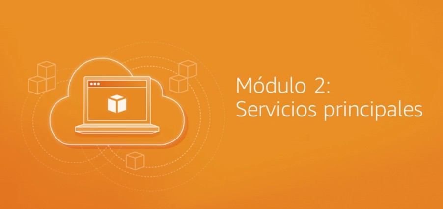
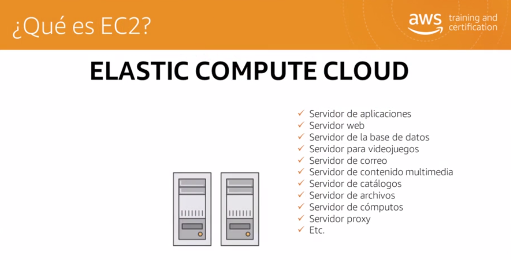
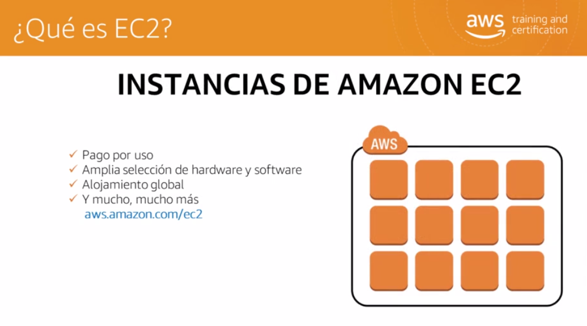
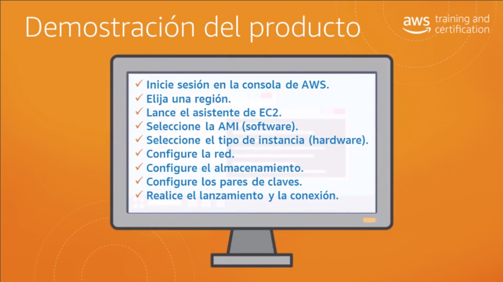
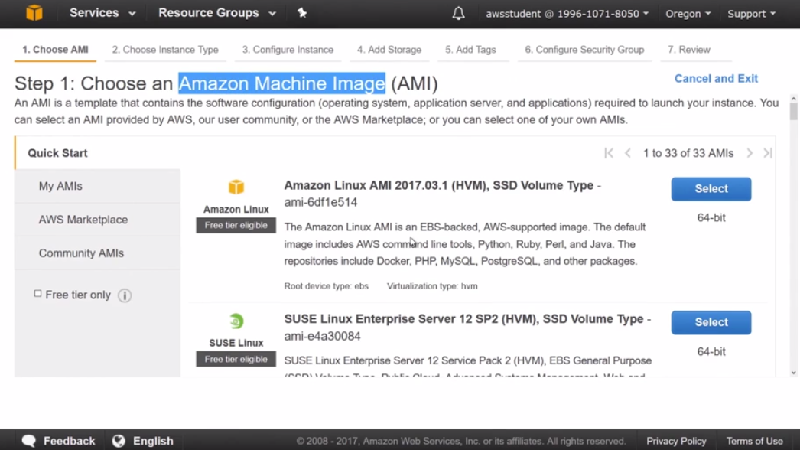

# Módulo 2 - Elastic Compute Cloud (Amazon EC2)

En primer lugar, **¿qué es EC2?** Es la abreviatura de **Elastic Compute Cloud**. **Compute** hace referencia a los **recursos informáticos** o de servidor que se presentan. Hay muchas cosas divertidas y emocionantes que puede hacer con los servidores. **Cloud** hace referencia al hecho de que tales recursos informáticos se alojan en la nube. **Elastic** hace referencia al hecho de que, con una configuración adecuada, es posible aumentar o reducir automáticamente la cantidad de servidores que requiere una aplicación en función de sus demandas actuales.

Pero dejemos de llamarlas **"servidores"** y usemos el nombre correcto: **Instancias de Amazon EC2**.

Las instancias son de pago por uso. Paga solamente cuando las instancias se ejecutan y por el tiempo en que ejecutan. Existe una amplia selección de hardware y software, así como una selección de donde alojar instancias. Hay mucho mas que eso. Para obtener mas información visite [**AWS EC2**](https://aws.amazon.com/ec2).

### Demostración del Producto EC2

Durante la demostración, iniciamos sesión en la consola de AWS, elegimos una región en la que vamos a alojar nuestra instancia, lanzamos el asistente de EC2, seleccionamos la **AMI (Amazon Machine Image)**, proporcionándonos una plataforma de software para nuestra instancia. A Continuación seleccionaremos el tipo de instancia, haciendo referencia a las capacidades de hardware. A continuación configuraremos la red, el almacenamiento y, por ultimo los pares de claves que nos permitirán conectarnos a la instancia después de lanzarla y conectarnos a ella.

Para el espacio de **Configure Instance Details (Configurar Detalles de Instancia)** existe la opción de crear N instancias de numero menor igual a 100000.

Es necesario también configurar el grupo de seguridad, un grupo de seguridad es un conjunto de reglas de Firewall. Crea de forma automática una regla predeterminada para la conectividad SSH. Puedo agregar otra regla para permitir una conectividad web sencilla. Le asigno un nombre sencillo como "SSH GTP", así se exactamente lo que proporciona el grupo de seguridad.

Por ultimo se debe hacer clic en **Review and Launch (Revisar y lanzar)**. Nos proporciona información general que nos recuerda nuestras selecciones, donde luego se debe hacer clic en **Launch (Lanzar)**.

Para poder conectarse al sistema mediante SSH, se necesita crear un par de claves, así que hago clic en **Create a New Key Pair (Crear nuevo par de claves)** para luego descargar la clave privada en la maquina local.

Aplicaciones necesarias para Windows: Putty y Puttygen para conectarse y generar un archivo PPK.