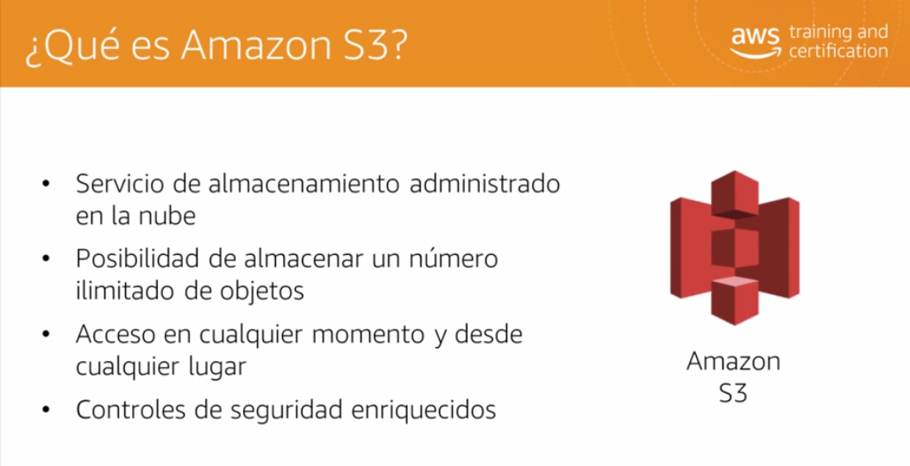
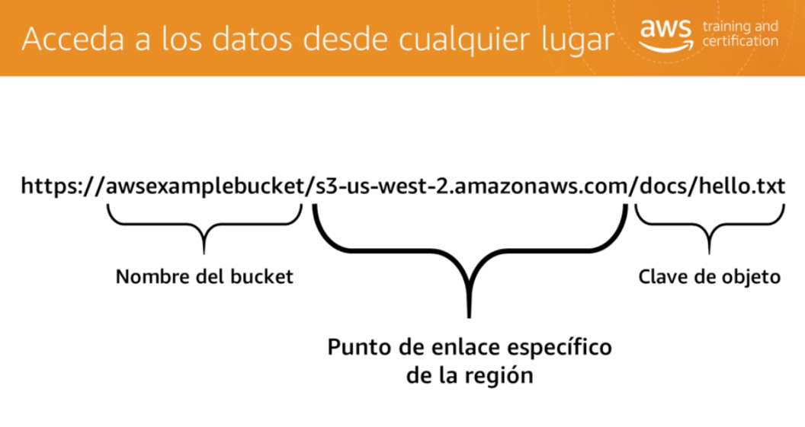
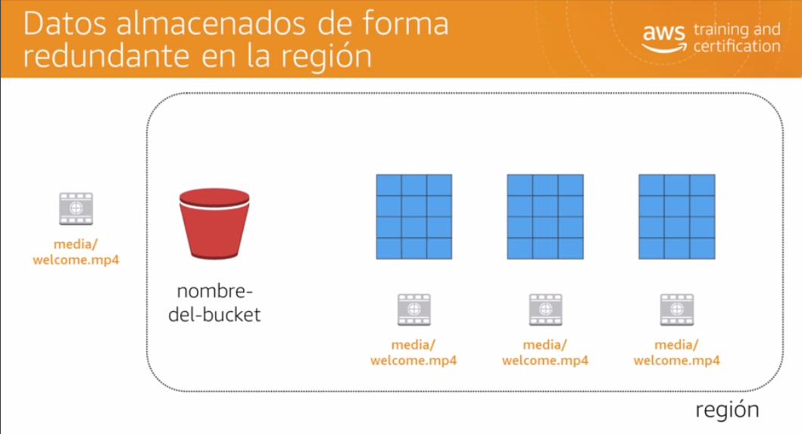
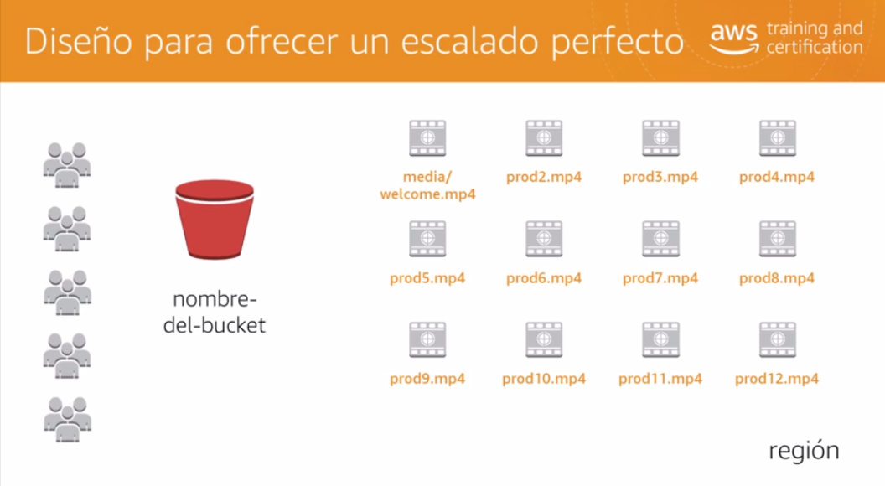

# Módulo 2 - Simple Storage Service - Amazon S3

**Amazon S3** es un servicio de almacenamiento completamente administrado que proporciona una API sencilla para almacenar y recuperar datos.

Esto significa que los datos que almacena en **Amazon S3** no esta asociado a ningún servidor en particular, y que no es necesario que administre ninguna infraestructura. Puede colocar tantos objetos como quiera en **Amazon S3**. **Amazon S3** contiene millones de objetos y, con regularidad, tiene picos de millones de solicitudes por segundo. Los objetos pueden ser prácticamente cualquier archivo de datos, como imágenes, videos o registros del servidor. Ya que en **Amazon S3** admite objetos de hasta varios TeraBytes de tamaño, incluso podría almacenar instantáneas de la base de datos como objetos. **Amazon S3** también proporciona acceso de baja latencia a los datos a través de internet mediante HTTP o HTTPS, de modo que puede recuperar los datos en cualquier momento y desde cualquier lugar. También puede acceder a **Amazon S3** de forma privada mediante un punto de enlace de la nube virtual privada. Obtendrá un control detallado de quien puede acceder a sus datos mediante políticas de administración de acceso e identidad, políticas de **bucket de S3 (contenedor de objetos)** e incluso listas de control de acceso por objeto.

De forma predeterminada, no se comparte ninguno de sus datos públicamente. También puede cifrar los datos de transito y habilitar el cifrado del lado del servidor en sus objetos. Tomemos un archivo que queramos almacenar, como un video de Bienvenida. En primer lugar, necesitamos un lugar para ponerlo. En **Amazon S3**, puede crear un **bucket (contenedor de objetos)** para almacenar los datos. Cuando queremos poner este video en nuestro **bucket** como un objeto, tenemos que especificar una clave, que es solo una cadena que se puede utilizar para recuperar el objeto mas adelante. Una practica habitual consiste en establecer estas cadenas de forma que se parezca a una ruta de archivo. Pongamos nuestro video en **Amazon S3** como un objeto con la clave correspondiente. Cuando se crea un **bucket** en **Amazon S3** se asocia con una región de **AWS** en particular. Cada vez que almacena datos en el **bucket**, estos se almacenan de forma redundante en varias instalaciones de **AWS** dentro de la región seleccionada. **Amazon S3** esta diseñado para almacenar sus datos de forma duradera, incluso en caso de que ocurra una perdida de datos simultanea en dos instalaciones de **AWS**. **Amazon S3** administra el almacenamiento detrás de su **bucket** de forma automática, incluso cuando sus datos aumenten. Esto le permite compensar a usarlo de inmediato y que su almacenamiento de datos crezca según las necesidades de su aplicación. **Amazon S3** también es escalable, lo que le permitirá manejar un alto volumen de solicitudes. No es necesario que aprovisione el almacenamiento o el rendimiento, y solo se le cobrara por lo que utilice. 

Puede obtener acceso a **Amazon S3** mediante la consola de administración, la CLI de **AWS** o el SDK de **AWS**. Ademas, puede acceder a los datos de su **bucket** directamente mediante los puntos de enlace **REST**. Estos admiten el acceso HTTP y HTTPS. Aquí vemos un ejemplo de una URL para un objeto creado a partir del punto de enlace de **Amazon S3** del nombre del **bucket** para la región seleccionada y la clave que utilizaremos cuando almacenemos el objeto. Para admitir este tipo de acceso basado en URL, los nombres de **bucket** de **S3** deben ser únicos a nivel global y compatibles como el DNS. Ademas, las claves de objetos deben utilizar caracteres que sean seguros para las URL.

Esta flexibilidad para almacenar  una cantidad prácticamente ilimitada de datos y acceder a ellos desde cualquier lugar hace que **Amazon S3** sea el servicio adecuado para una amplia variedad de casos. A continuación veremos algunos casos de uso de **Amazon S3**.

Como ubicación para cualquier dato de aplicación, los **buchets** de **S3** proporcionan la ubicación compartida para almacenar objetos a la que cualquier instancia de su aplicación puede acceder, incluso las aplicaciones de **EC2** o hasta los servidores tradicionales. Esto puede resultar útil para archivos multimedia generados por el usuario, registro del servidor u otros archivos que su aplicación necesite almacenar en una ubicación común. Ademas, como el contenido se puede obtener de forma directa por medio de la Web, es posible reasignar una parte de ese contenido de su aplicación y permitir que los clientes obtengan los datos directamente de **Amazon S3**. Para el alojamiento web estático, los **buckets** de **S3** pueden entregar el contenido estático de su sitio web, que incluye HTML, CSS, JavaScript y otro tipo de archivos. La gran durabilidad de **Amazon S3** lo convierte en una buena opción para almacenar copias de seguridad de sus datos. Para una disponibilidad y capacidad de recuperación de desastres aun mayores, **Amazon S3** puede incluso configurarse para que admita la replicación entre regiones, de modo que los datos colocados en un **bucket** de **Amazon S3** en una región puedan replicarse de forma automática en otra región de **Amazon S3**. 

El almacenamiento estable y el rendimiento de **Amazon S3** lo convierten en un gran candidato para el almacenamiento provisional o el almacenamiento a largo plazo de aquellos datos que planea analizar utilizando una variedad de herramientas de big data. Por ejemplo, la fase de datos de **Amazon S3** se puede cargar en **Redshift**, procesar en **EMR** o incluso consultar en el lugar con herramientas como **Amazon Athena**. También puede importar o exportar grandes volúmenes de datos de **Amazon S3** con dispositivos de **AWS Import/Export**, como **Snowball**. Dado lo sencillo que es almacenar datos y acceder a ellos con **Amazon S3**, se dara cuenta de que lo usa con frecuencia con los servicios de **AWS** y para otras partes de su aplicación. Ahora que hemos analizado la funcionalidad de **Amazon S3** y los casos de uso comunes, debería poder identificar como **Amazon S3** puede ayudarle a crear su aplicación en **AWS**.

