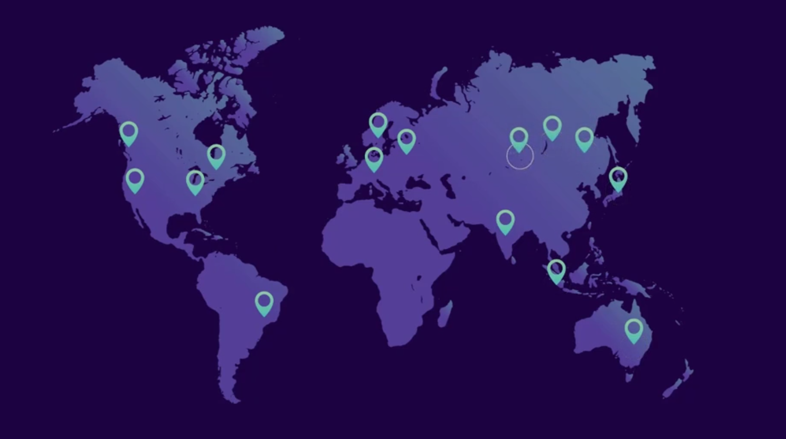
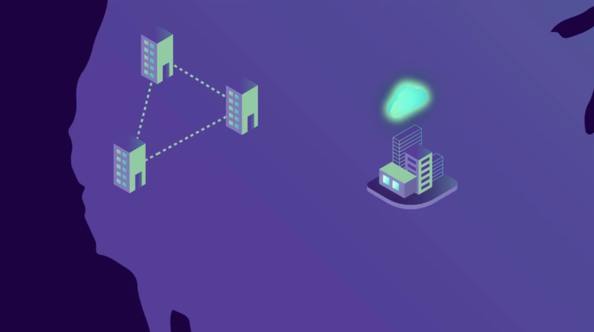
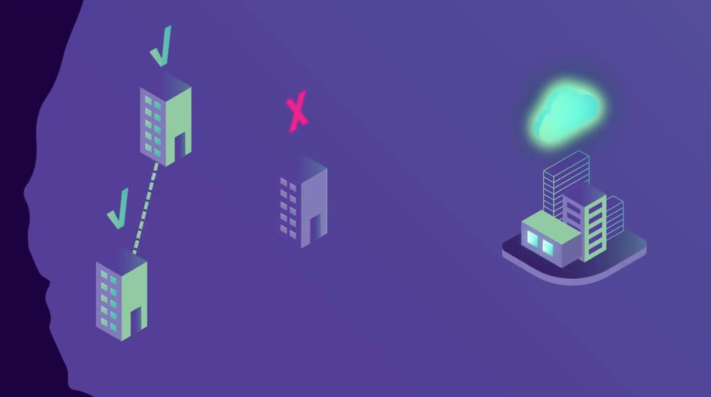

# Módulo 2 - Infraestructura Grobal

Bienvenido a la lección sobre infraestructura global de **AWS**. Cuando aloja sus necesidades de **TI** con **AWS**, es importante comprender cómo se configura **AWS**.

La infraestructura global de **AWS** se puede dividir en tres elementos:

- **Regiones de AWS**
- **Zonas de disponibilidad**
- **Ubicaciones de Borde**

----
- **Regiones**

Las **regiones** son áreas geográficas que alojan dos o más zonas de disponibilidad y son el nivel organizativo de los servicios de **AWS**. Cuando implemente recursos con **AWS**,  elegirá una región en la que se encuentran dichos recursos. Al hacerlo, es importante tener en cuenta qué región le ayudará a optimizar la latencia a la vez que minimiza los costos y cumple los requisitos normativos.

También puede implementar recursos en varias regiones para que se adapten mejor a las necesidades de su negocio. Por ejemplo, si los recursos para desarrolladores necesitan implementarse en una región, pero su base de clientes principal está en una región diferente, puede implementar recursos de desarrollo en una región y su solución orientada al cliente en otra región. O bien, puede implementar los mismos recursos en varias regiones, lo que le permite ofrecer una experiencia uniforme en todo el mundo, independientemente de la ubicación de sus clientes. Minimizará la latencia y aumentará la agilidad de su organización en minutos y con un costo mínimo. 

Por último, las regiones son entidades completamente independientes entre sí. Los recursos de una región no se replican de forma automática en otras regiones y no todos los servicios están disponibles en todas las regiones, aunque algunos de los servicios de **AWS** más comunes están disponibles en todas las regiones, como **Amazon S3** o **Amazon EC2**. Puede ver qué servicios están disponibles en cada región consultando la página de infraestructura global. https://aws.amazon.com/about-aws/global-infrastructure/

----
- **Zonas de disponibilidad**

Las **zonas de disponibilidad** son una colección de centros de datos dentro de una región específica. Las **zonas de disponibilidad** está físicamente aisladas de las demás, pero conectadas entre sí mediante una red rápida y de baja latencia.

Cada **zona de disponibilidad** es una infraestructura físicamente distinta e independiente. Están separadas de manera física y lógica. Cada una de ellas tiene su propia fuente de alimentación ininterrumpida y discreta, generadores de copias de seguridad in situ, equipos de refrigeración, redes y conectividad. Se suministran mediante diferentes redes de compañías de servicios públicos independientes para el suministro eléctrico y se conectan en Red por medio de varios proveedores de tránsito de nivel 1.

El aislamiento de las zonas de disponibilidad significa que están protegidas contra errores que se produzcan en otras zonas, lo que garantiza una alta disponibilidad. La redundancia de datos dentro de una región significa que, si una zona deja de funcionar las demás pueden gestionar solicitudes. 

Esta es una de las razones por la que **AWS** recomienda aprovisionar sus datos en varias zonas de disponibilidad como práctica recomendada

----
- **Ubicación de borde**

Ahora vamos a cubrir el tercer componente, las **ubicaciones de borde**. Las **ubicaciones de borde** de **AWS** alojan una red de entrega de contenido (o CDN) llamada **Amazon CloudFront**. **CloudFront** se utiliza para entregar contenido a sus clientes. Las solicitudes de contenido se direccionan de forma automática hasta la ubicación de borde más cercana,  para que el contenido se entregue a los usuarios finales con mayor rapidez.

Cuando se utiliza la red global de **ubicaciones de borde**, los clientes tienen acceso a una entrega de contenido más rápida. Las ubicaciones de borde suelen estar ubicadas en zonas muy pobladas. 

En esta formación técnica, se ha presentado la infraestructura general de **AWS** incluidas las **regiones**,  las **zonas de disponibilidad** y las **ubicaciones de borde**. También hemos cubierto algunas de las características únicas de las **zonas de disponibilidad** que hacen que sean **duraderas** y de **confianza**.