# Módulo 3 - Auto Scaling

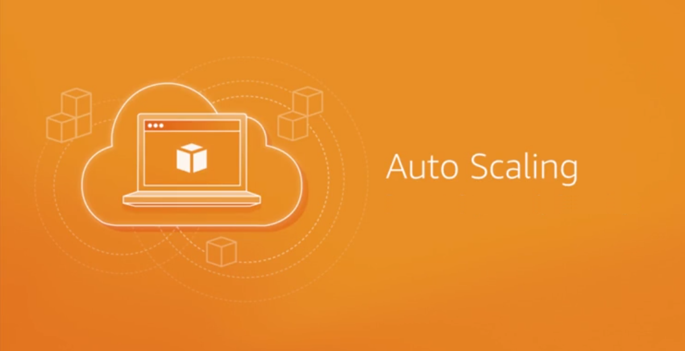

¿Qué es Auto Scaling? **Auto Scaling** lo ayuda a garantizar que cuenta con la cantidad correcta de instancias de **Amazon EC2** disponibles para manejar la carga de su aplicación. Con **Auto Scaling**, elimina las especulaciones sobre cuantas instancias **EC2** necesita en un momento específico para satisfacer los requisitos de su carga de trabajo.

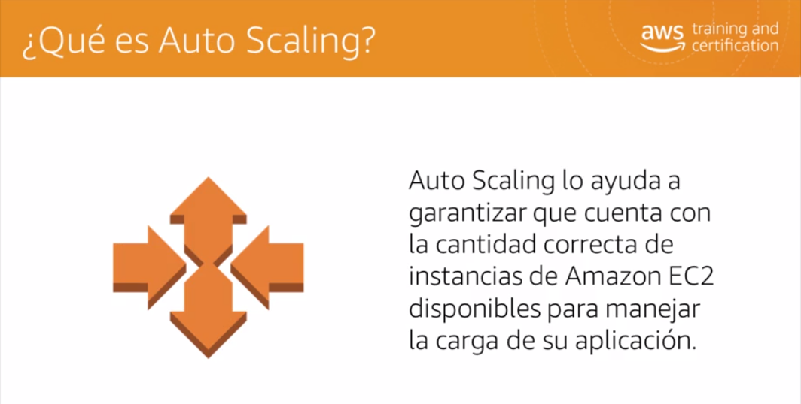

Cuando ejecuta sus aplicaciones en instancias **EC2** es fundamental monitorear el rendimiento de su carga de trabajo con **Amazon CloudWatch**. Sin embargo, CloudWatch por sí solo no agrega ni elimina instancias **EC2**. Aquí es donde **Auto Scaling** entra en escena. Veamos un ejemplo de carga de trabajo. Utilizaremos CloudWatch para medir los requisitos de los recursos **EC2** en una semana estándar. Observe que los requisitos de recursos varían. El miércoles se necesita la mayor capacidad y el sábado, la menor. Podríamos optar por asignar más capacidad de **EC2** que la necesaria para satisfacer siempre nuestro momento de mayor demanda; en este caso, el miércoles. Sin embargo, esto significa que estamos ejecutando recursos que se infrautilizarán la mayoría de los días de la semana. Esta es una opción, pero en ella los costos no están optimizados.

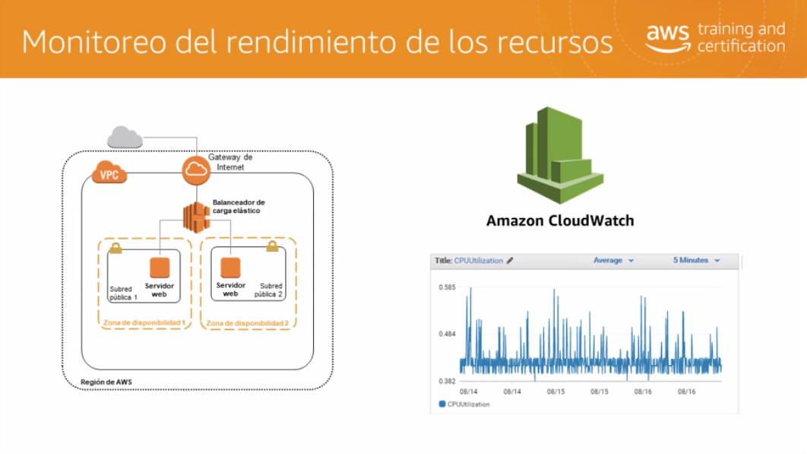

En el otro extremo de la escala, podríamos asignar menos instancias **EC2** y, así, reducir los costos. Esto significa que ciertos días estamos por debajo de la capacidad. Si no resolvemos el problema de capacidad, nuestra aplicación podría tener un rendimiento insuficiente o incluso agotar el tiempo de espera para el usuario. Por supuesto, esto no es algo bueno. **Auto Scaling** le permite agregar o eliminar instancias **EC2** en función de las condiciones que especifique. 

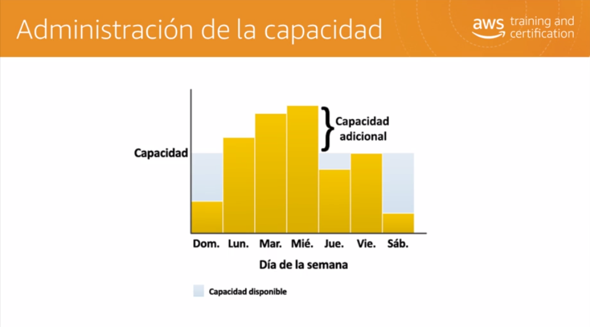

**Auto Scaling** es especialmente potente en entornos con requisitos de rendimiento fluctuantes. Esto le permite mantener el rendimiento y minimizar los costos. Por lo tanto, **Auto Scaling** responde dos preguntas críticas: 

1. **¿Cómo puedo asegurarme de que mi carga de trabajo tenga suficientes recursos de EC2 para satisfacer los requisitos de rendimiento fluctuantes?**
2. **¿Cómo puedo automatizar el aprovisionamiento de recursos de EC2 para que se realice bajo demanda?**

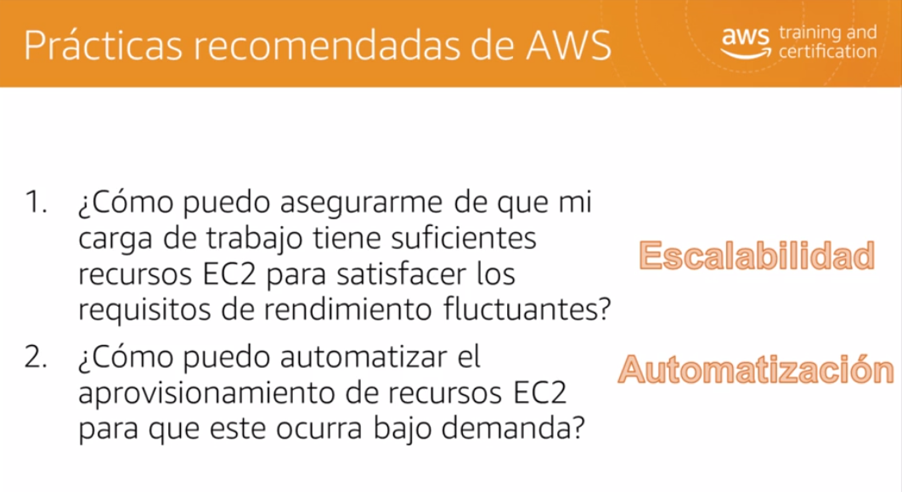

**Auto Scaling** se adapta a dos prácticas recomendadas de **AWS** críticas: hacer que su entorno sea escalable y automatizar lo más posible. Examinemos el servicio en mayor profundidad.

Entonces, **¿qué significa exactamente el escalado?** Lo primero que tenemos que hacer es definir los conceptos de escalado horizontal y reducción horizontal. **Auto Scaling** puede ajustar automáticamente la cantidad de instancias **EC2** que se ejecutan en la carga de trabajo en función de las condiciones que defina, como una utilización de la CPU superior al 80%, por ejemplo, o la utilización programada. Si **Auto Scaling** agrega más instancias,  esto se denomina **”escalado horizontal”**. Cuando **Auto Scaling** termina la instancia, se denomina **”reducción horizontal”**. Recuerde que puede controlar qué da inicio a estos eventos. 

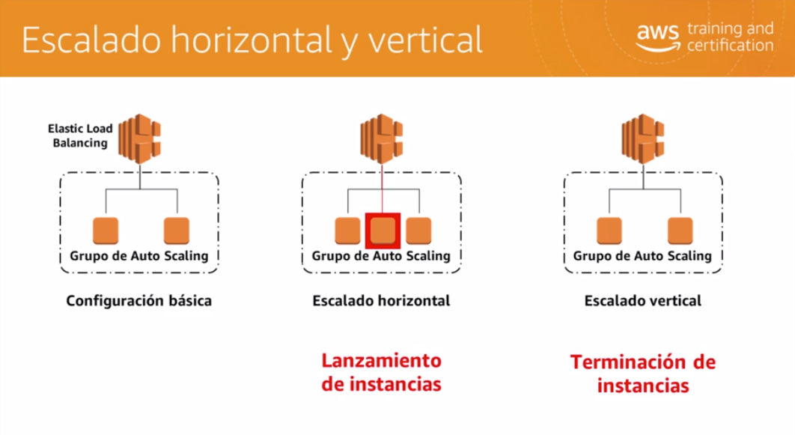

**¿Cómo se realiza el escalado automático?** Existen tres componentes necesarios para el escalado automático.

1. Primero, hay que crear una configuración de lanzamiento. 
2. Segundo, crear un grupo de **Auto Scaling**.
3. Tercero, definir al menos una política de **Auto Scaling**. 

**¿En qué consiste una configuración de lanzamiento?** Es la definición de qué lanzará **Auto Scaling**. Piense en todas las cosas que se especifican cuando se lanza una instancia **EC2** desde la consola; por ejemplo, qué imagen de **Amazon Machine** utilizar, qué tipo de instancia, grupo de seguridad o roles se aplican a la instancia. 

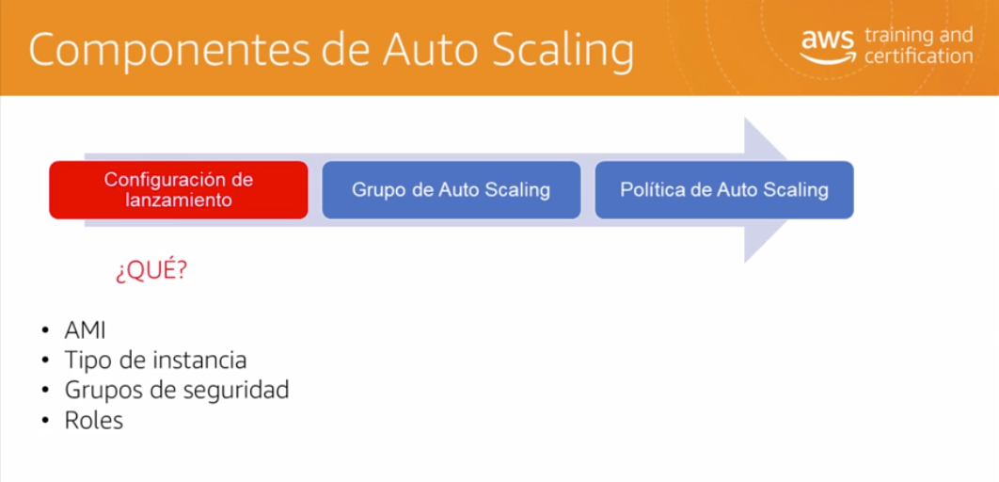

**¿Qué es un grupo de Auto Scaling?** Es el grupo que se encarga de definir dónde se realizará la implementación y cuáles son los límites. Aquí es donde usted define que **VPC** se utilizará para implementar instancias y con qué balanceador de carga interactuar. También especifica los límites para un grupo. Si Configura un mínimo de dos instancias y el número de servidores es inferior, se lanzará otra instancia para suplir la diferencia. Si configura el máximo de ocho, nunca tendrá más de ocho instancias en su grupo. La capacidad deseada es la cantidad con la que quiere comenzar. 

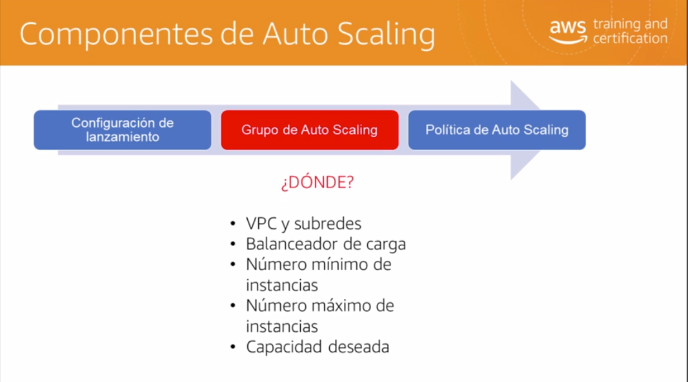

**¿Qué es una política de Auto Scaling?** Es aquella que se encarga de especificar cuándo lanzar o terminar instancias **EC2**. Por ejemplo, puede programar **Auto Scaling** todos los jueves a las 15:00 o crear condiciones que definan umbrales para desencadenar el agregado o eliminación de instancias. Las políticas basadas en condiciones hacen que **auto Scaling** sea dinámico y pueda satisfacer los requisitos fluctuantes. Una práctica recomendada es crear, al menos, una política de **Auto Scaling** para especificar cuando hacer un escalado horizontal y, al menos, una política para especificar cuándo hacer una reducción horizontal. 

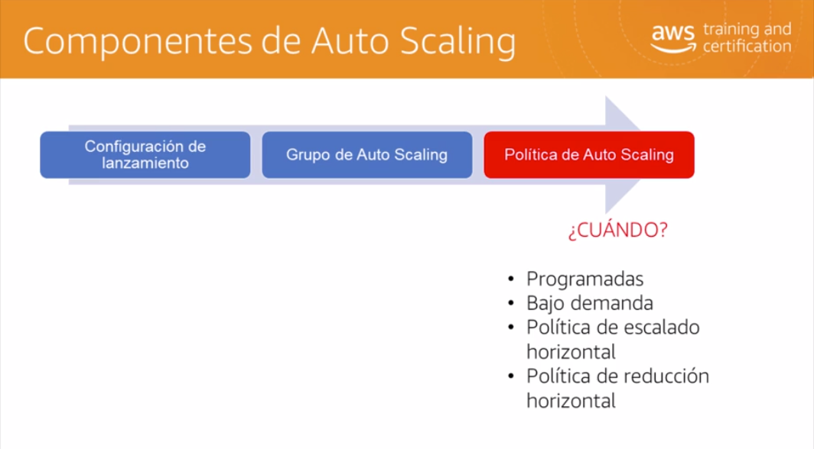

**¿Cómo funciona Auto Scaling dinámico?**  Una configuración común es crear alarmas de **CloudWatch** basadas en la información de rendimiento de sus instancias **EC2** o un balanceador de carga. Cuando se supera un umbral de rendimiento, una alarma de **CloudWatch** desencadena un evento de **Auto Scaling** que genera un escalado o reducción horizontal en las instancias **EC2** del entorno.  

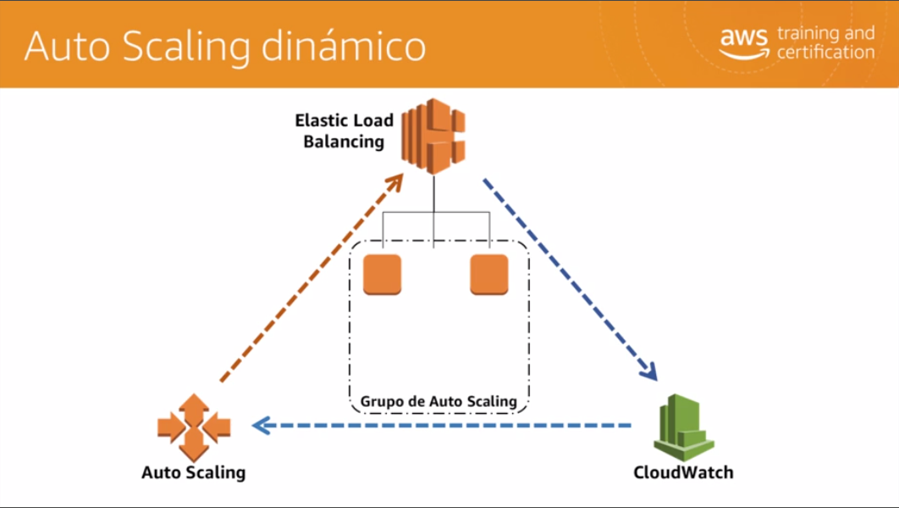

Echemos un vistazo a una alarma de **Cloud Watch** por ejemplo.

La primera parte de la alarma es una condición con un umbral específico. En este caso, una utilización de la CPU superior al 80%. 

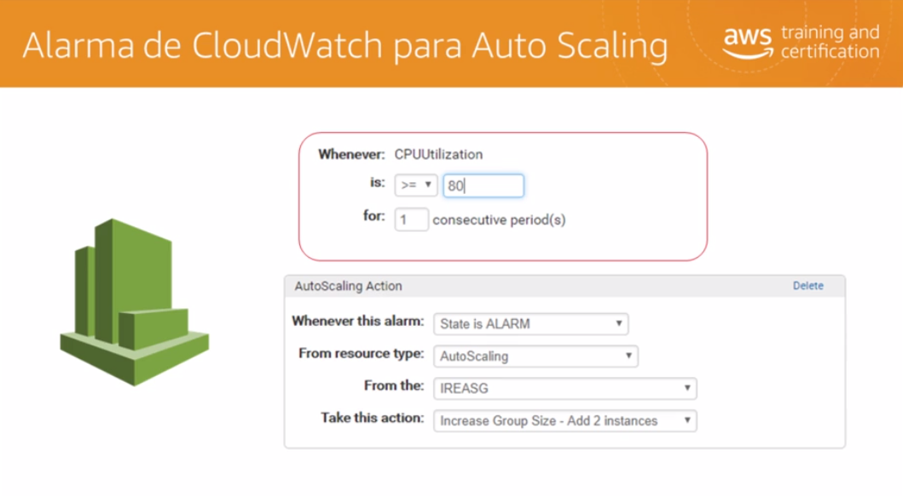

Tenga en cuenta que también hay un período especificado que puede controlar. Esto significa que podríamos especificar que la alarma se activará si la utilización de la CPU supera el 80% durante cinco minutos consecutivos. El período es fundamental, ya que no querrá qué **Auto Scaling** desencadene nuevas instancias por que el procesador alcanzó picos de utilización durante treinta segundos. La segunda parte de la alarma es la acción que se debe realizar después de que se activa la alarma. Con **Auto Scaling**, la acción podría ser agregar o eliminar instancias. En este caso, cuando la CPU supera el 80% durante un período consecutivo (cinco minutos de forma predeterminada), **Auto Scaling** agrega dos nuevas instancias al grupo de **Auto Scaling**. A medida que agregamos más instancias, la utilización de la CPU debería disminuir. Deberíamos establecer otra alarma de **CloudWatch** para definir un umbral en torno a cuándo deben terminarse las instancias del grupo de **Auto Scaling**. Por ejemplo, si la utilización de la CPU está por debajo de 20% durante más de cinco minutos consecutivos, debería terminarse una instancia. Lo bueno de esto es que **Auto Scaling** puede administrar su carga de trabajo de forma dinámica para que usted pueda concentrarse en otros asuntos.