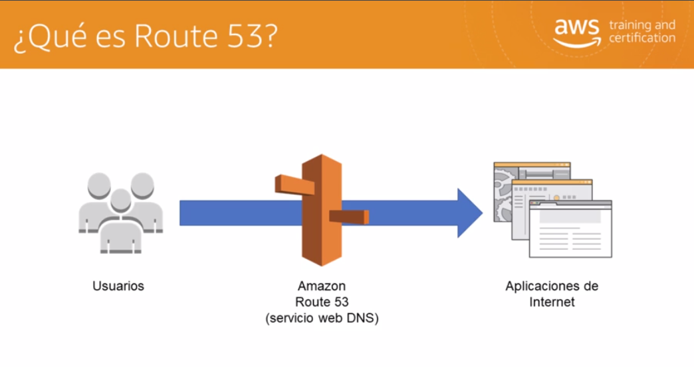
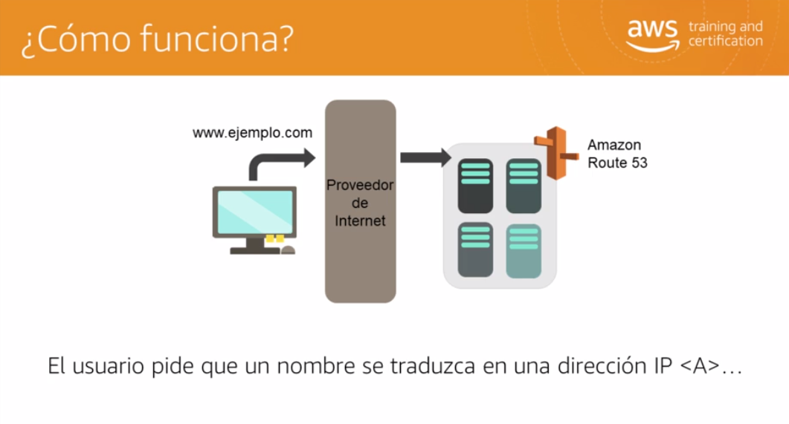

# Módulo 3 - Amazon Route 53

**¿Qué es Amazon Route 53?** Trata de un servicio web de sistema de nombres de dominio o DNS,  diseñado a fin de proporcionar a las empresas y los desarrolladores un modo altamente escalable y fiable para direccionar a los usuarios finales a las aplicaciones de internet.

Puede ver a  **Route 53** como una libreta de direcciones. Usted sabe que tiene que ir a cenar a la “casa de Susana” más tarde; su libreta de direcciones sabe que eso significa que debe ir a la dirección “calle ABC Norte 123”. **Route 53**  traduce nombres, como www.example.com a direcciones IP numéricas que los equipos utilizan para conectarse entre sí. Veamos en mayor profundidad la información general sobre el servicio. **Route 53** es un servicio web DNS, pero ¿qué es DNS? Dicho de forma sencilla, un DNS es un traductor. Imaginé que quiere crear un sitio web para que los clientes encuentren y utilicen su contenido. Para que esto ocurra, necesita internet, lo cual quiere que hable el idioma de todos esos clientes potenciales.

Las direcciones IP son el idioma de Internet. Las personas pondrán un nombre a su sitio web, como www.example.com, qué debe traducirse a una dirección IP para que los sistemas informáticos puedan comunicarse entre sí. Aquí es donde el DNS entra en escena. A fin de proporcionar traducción de DNS para su nombre de dominio, puede administrar su propio servidor DNS o utilizar un DNS administrado, como **Route 53**.

**¿Cómo funciona?** Un usuario abre un navegador web y escribe el nombre de dominio de un sitio web. Aquí, es www.example.com. Esa consulta suele direccionarse al servicio de resolución de DNS de un proveedor de Internet. Si **Amazon Route 53** administra el DNS de ese sitio web, el servicio de resolución de DNS del proveedor de Internet reenvía la solicitud a los servidores de nombres de dominio alojados y administrados por **Amazon Route 53**. Luego el servidor de nombres de **Route 53** toma el valor asociado a www.example.com (192.0.2.44) y devuelve esa dirección IP al servicio de resolución de DNS del proveedor de Internet, que a su vez proporciona al usuario el contenido especificado. 

