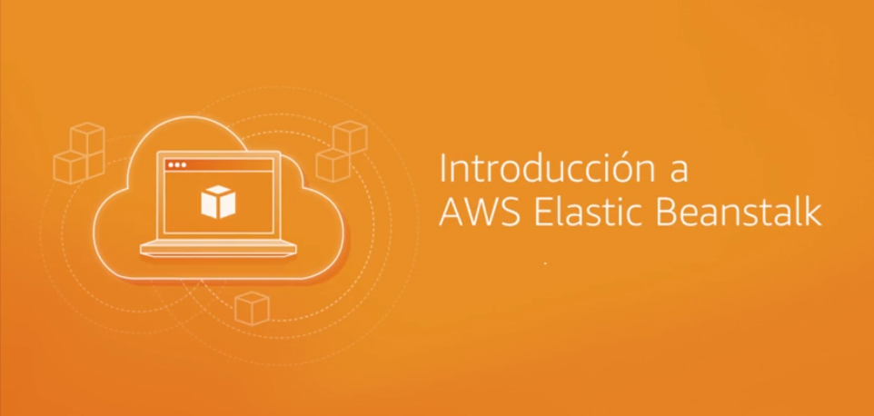
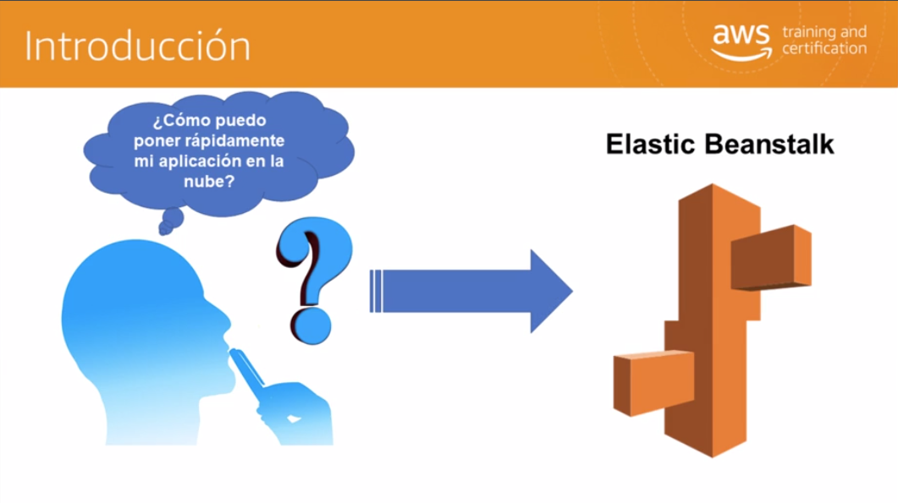
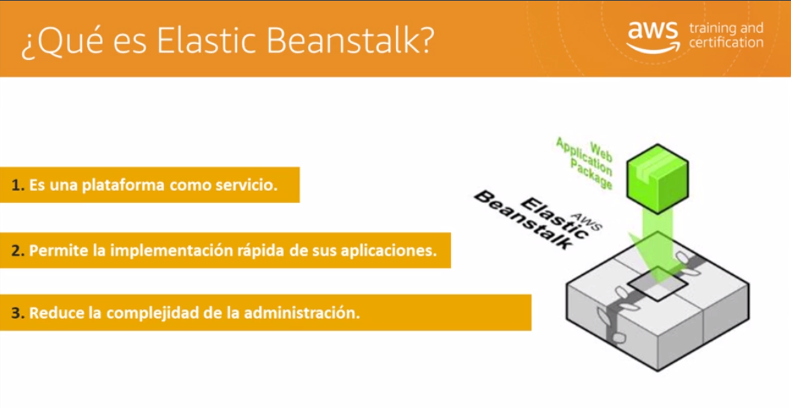
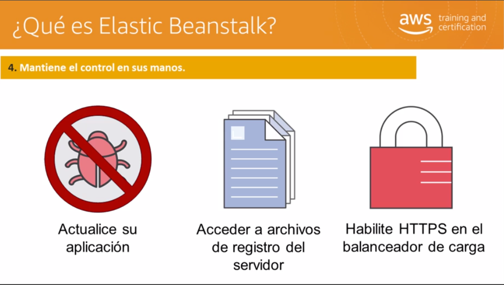
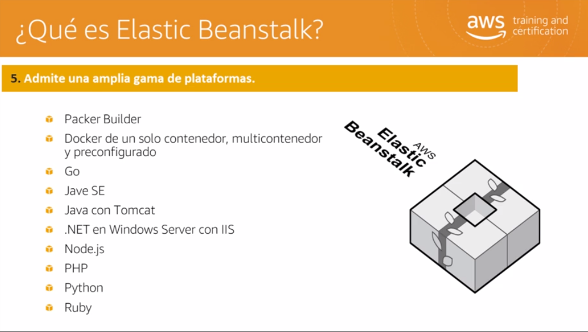
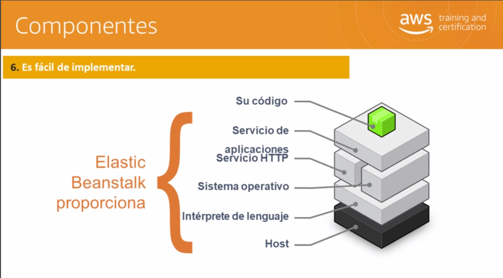
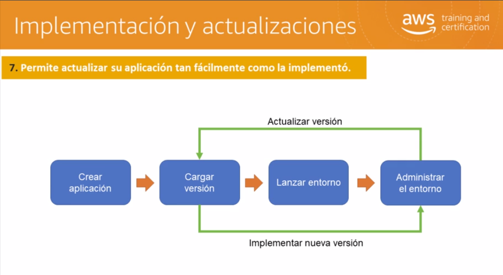

# Módulo 3 - AWS Elastic Beanstalk

Supongamos que es un desarrollador de un servidor web. Es posible que no le preocupe desarrollar toda la administración de su sistema y administrar todo lo que hay detrás del desarrollo de los servidores. Tal vez se pregunte: **”¿Cómo puedo colocar rápidamente mi aplicación en la nube?”** **”¿Cómo puedo tener todo el entorno listo de forma rápida para que podamos comenzar a desarrollar el sistema?”** La respuesta es **AWS Elastic Beantsalk**.

Pero, **¿cómo funciona en realidad AWS Elastic Beanstalk? ¿Cuáles son los beneficios y características del sistema?** Se trata de una plataforma como servicio lo cual significa que la totalidad de la infraestructura y la plataforma ya han sido creadas para que usted pueda simplemente colocar el código en el sistema en la medida de lo necesario. Además, permite una implementación rápida de sus aplicaciones. 

Cualquier código que haya escrito previamente en algún lenguaje específico se puede colocar de modo sencillo en la plataforma que tenga. Asimismo, reduce la complejidad de la administración. No tiene que preocuparse por administrar todo el sistema, pero, si lo desea puede tener control total sobre ello. El control del sistema, que ya está desarrollado, le permite elegir el tipo de instancia o base de datos según lo que necesite. 

Además le permite ajustar **Auto Scaling** según sus necesidades. También le permite actualizar la aplicación y acceder a los archivos de registro del servidor, y habilitar HTTPS en el balanceador de carga de acuerdo con las necesidades de su aplicación. También es compatible con una amplia gama de plataformas. Estas incluyen Packer Build, Single Container, Multicontainer o Preconfigured Docker. Admite Go, Java con Tomcat, JavaSE, .NET en Windows Server con IIS, Node.js, PHP, Python y Ruby. Por lo tanto en función de sus habilidades y de su idea para desarrollar los servidores web, puede simplemente escribir el código y utilizar **Elastic Beanstalk** para implementar el entorno según lo necesite.

**Elastic Beanstalk** proporcionará todos los servicios de aplicaciones, el servicio HTTP, el sistema operativo, el intérprete de idioma y el host. Sólo tiene que crear el código, implementarlo, prepararlo de acuerdo con las necesidades de su servicio y, luego, simplemente utilizar la aplicación según sea necesario. Con eso, habrá realizado una implementación de modo muy sencillo. 

Además los pasos para implementar y utilizar los servidores se basan únicamente en la creación de la aplicación. Después de eso cargará las versiones en **Beanstalk**, que luego lanzarán todos los entornos necesarios en la nube de acuerdo con la necesidad de su aplicación. 

Luego, puede administrar su entorno y, si necesita escribir una nueva versión, sólo tiene que actualizarla. El punto es que puede manejar todo eso. Con este ciclo resulta tan sencillo actualizar la aplicación como implementarla.

