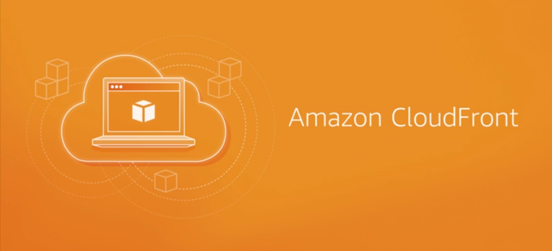
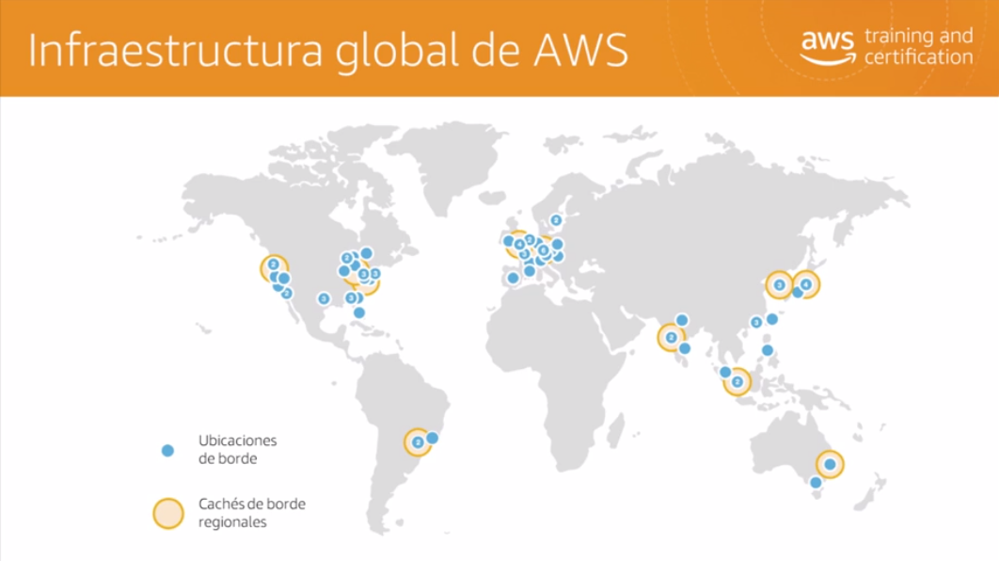
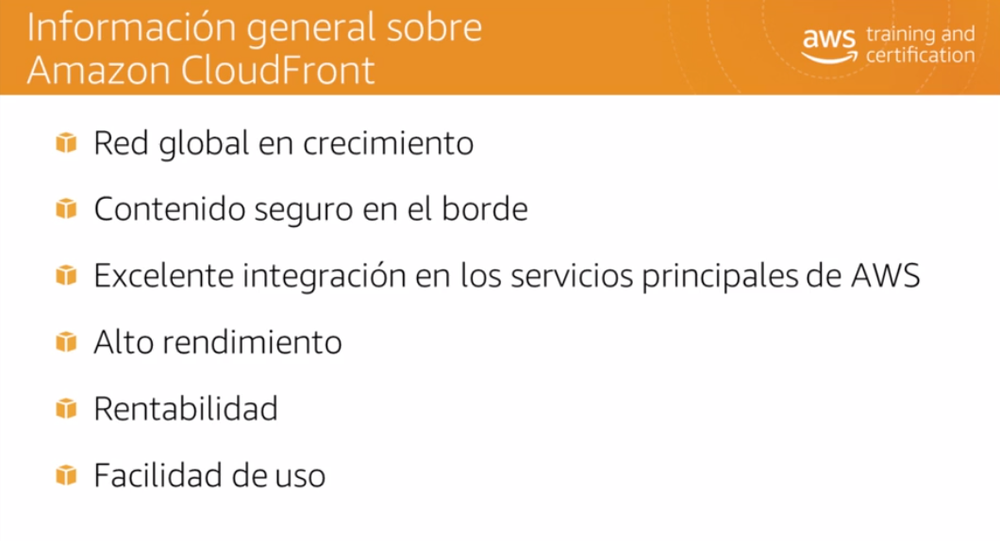
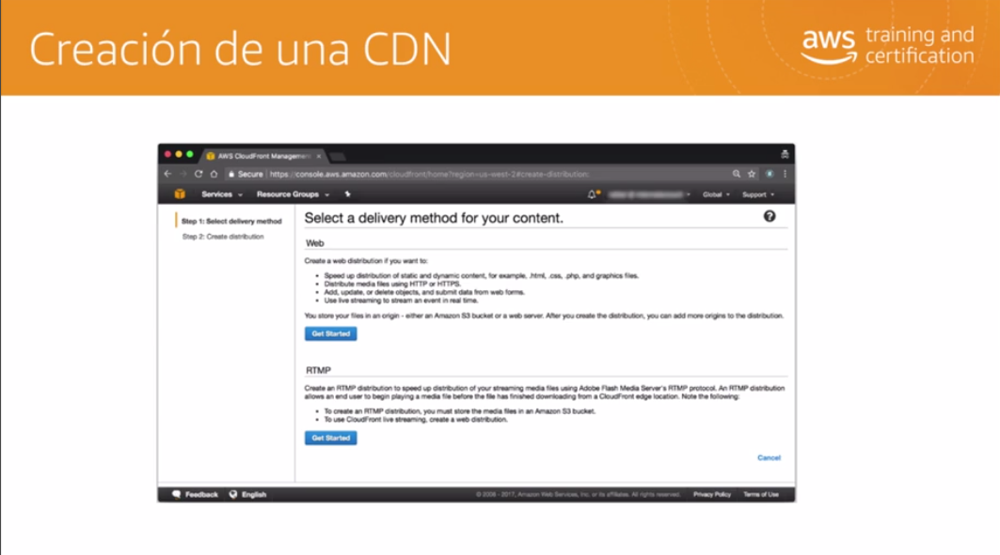
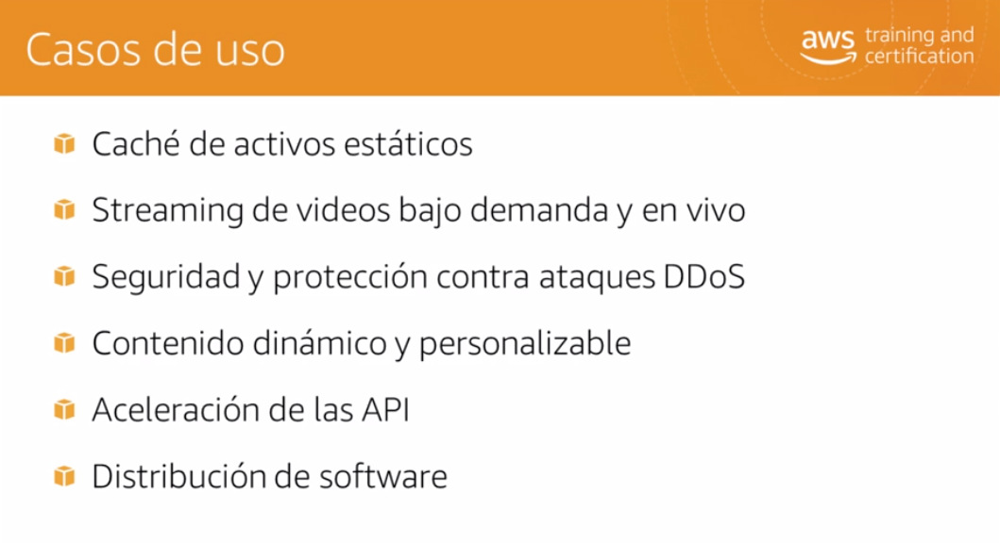

# Móculo 3 - Amazon CloudFront

Amazon **CloudFront** es un servicio de **AWS** que le permite realizar un escalado horizontal, ahorrar dinero y aumentar el rendimiento de sus aplicaciones. 

Veamos la infraestructura global de **AWS** y cómo se relaciona con **CloudFront**. Para entregar contenido a sus usuarios **Amazon CloudFront** utiliza una red global de más de 80 ubicaciones y más de 10 caches de borde regionales para la entrega de contenido. Las ubicaciones de borde se encuentran en varios países y de todo el mundo, y este número aumenta con frecuencia. Básicamente, si utiliza **CloudFront**, puede aprovechar varias ubicaciones en todo el mundo para entregar el contenido y, de este modo, permitir que los usuarios interactúen con su aplicación con menor latencia. Por ejemplo, si su aplicación se ejecuta en Singapur y sus usuarios se encuentran en Nueva York, puede utilizar **CloudFront** para almacenar en caché dicho contenido de manera local en Nueva York y dejar que el servicio lo ayude a escalar las solicitudes de demanda.

Con estos puntos de presencia en todo el mundo, podemos decir que **Amazon CloudFront** es una red de entrega de contenidos o **CDN**, de forma abreviada. **CloudFront** le permite ahorrar dinero debido a las tarifas más bajas de transferencia saliente de datos. Además, lo ayuda a lograr que sus clientes estén más satisfechos, ya que pueden almacenar el contenido en caché cerca de ellos, lo que aumenta la posibilidad de entregar contenido con mayor rapidez. Está profundamente integrado en todos los servicios de **AWS** como **AWS Web Application Firewall**, **AWS Certificate Manager**,  **Amazon Route 53**, **Amazon S3** y otros. 

Es bastante sencillo crear y configurar una **CDN** en **CloudFront**. La forma más sencilla de comenzar es ir a la consola de administración de **AWS** y hacer clic en el botón **Create Distribution (Crear Distribución)**. A continuación, elija cuál es el tipo de **CDN** que quiere crear. **RTMP** que se utiliza para streaming de video, y **Web** está diseñado para el uso de la entrega de contenido habitual distinta de la transmisión de video. Esto no significa que este contenido sólo deba ser estático. Puede utilizar **CloudFront** para entregar contenido dinámico también en una distribución web.

En la siguiente pantalla, debe especificar al menos un origen y un comportamiento. Básicamente, el origen puede ser su **bucket** de **S3** o cualquier aplicación que ejecute incluso fuera de **AWS**. Se puede colocar la dirección IP de su servidor web, el punto de enlace del balanceador de carga o cualquier otro punto de enlace al que se pueda acceder a través de internet. El comportamiento coincide fundamentalmente con: “¿Cuál es el patrón de URL que quiere asociar a ese origen?” Debe especificar un origen ahora, pero siempre puede agregar estas diferencias más adelante. Puede tener varios orígenes asociados a varios comportamientos. Por ejemplo, puede utilizar un **bucket** de **S3** como origen para las solicitudes que son su **CDN/images**. Por ejemplo SampleApplication.net/images. Asimismo, puede utilizar el balanceador de carga elástico para todo lo demás. En la misma pantalla, puede desplazarse hacia abajo y encontrar el botón de crear la distribución de **CDN**. Puede hacerlo totalmente de modo autoservicio y sin necesidad de abrir una incidencia de soporte técnico. Incluso puede utilizar otros servicios de **AWS** o la interfaz de línea de comandos de **AWS** a fin de automatizar la creación de nuevas distribuciones para entornos nuevos.
Algunos casos de uso incluyen, por ejemplo, el almacenamiento en caché de activos estáticos, en streaming de vídeo en directo y bajo demanda, la seguridad y la protección DDoS, la aceleración de la API y, en realidad, lo que permita su imaginación. En **AWS** estamos interesados en aprender de usted: ¿Cuál es su caso de uso para nuestros servicios?

