# Módulo 3 - AWS CloudFormation

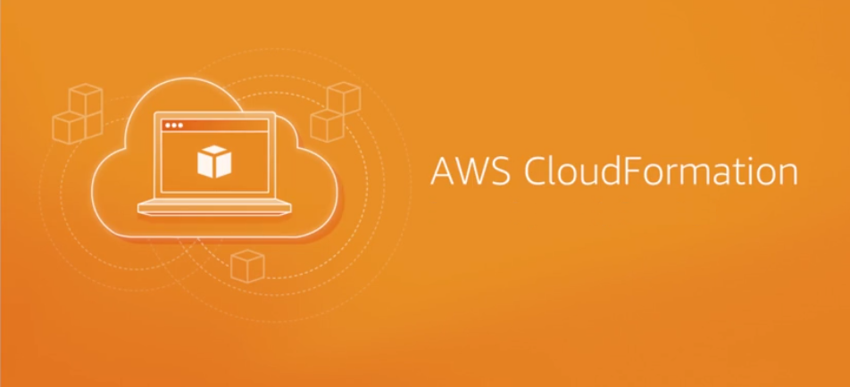

**¿Qué es CloudFormation?** **CloudFormation** simplifica la tarea de crear de forma repetida y predecible grupos de recursos relacionados que impulsen sus aplicaciones. Tenga en cuenta que estas palabras clave: 

- **simplifica**
- **repetida** 
- **predecible**

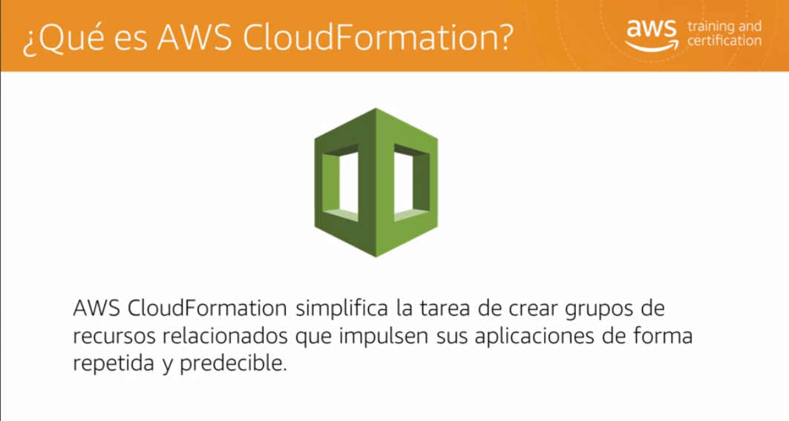

**CloudFormation** se basa en automatizar el aprovisionamiento de recursos. ¿Cómo interactuamos con los servicios de AWS? Llamamos a las interfaces de programación de aplicaciones, o API, para indicar al servicio lo que debe hacer. Existen tres métodos para llamar a las API: la consola de administración de AWS, la interfaz de línea de comandos de AWS, o CLI y el uso de kits de desarrollo de software específicos del lenguaje o las llamadas directas a la API.

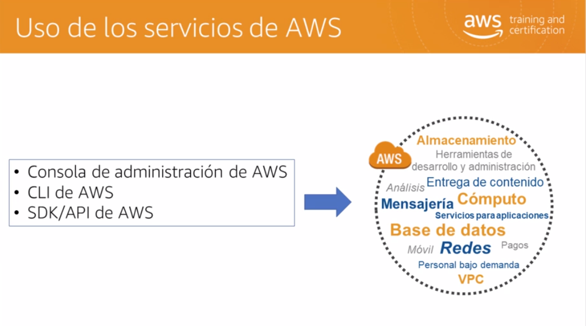

Con uno de los tres métodos, podemos construir entornos virtuales para las cargas de trabajo. Utilizamos llamadas a la API, como **CreateVPC**, para construir una nube virtual privada, o **LaunchInstances**, para crear una nueva instancia **EC2**. En este ejemplo, tenemos una aplicación que se ejecuta en una instancia **EC2**, en una única subred dentro de la **VPC**. La aplicación llama a una tabla de **DynamoDB** y utiliza un **bucket** de **S3**.

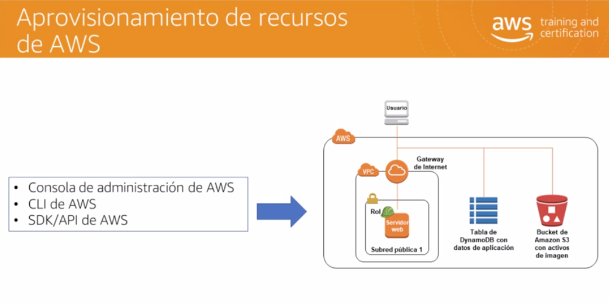

 **¿Cómo podemos automatizar este proceso?** O **¿cómo puedo duplicar este entorno?** De modo más específico: **¿cómo puedo automatizar el aprovisionamiento de recursos de AWS?** Aunque existen varias herramientas diferentes que puede utilizar para la automatización, **CloudFormation** es esencial para comprender debido a su potente alcance de tantos servicios de **AWS**. ¿Para qué se utiliza **CloudFormation**? En primer lugar, es un servicio completamente administrado, por lo que no es necesario admitir ninguna infraestructura. **CloudFormation** puede crear, actualizar y eliminar recursos y conjuntos conocidos como **”pilas”**.

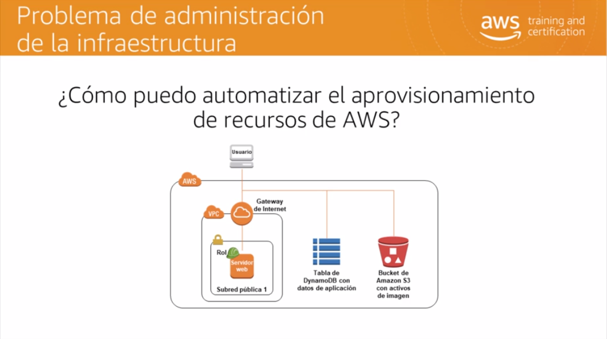

Obtendremos información general sobre el servicio y analizaremos algunos posibles casos de uso. El proceso general de **CloudFormation** es muy sencillo. La confirmación lee archivos de plantilla. ¿Qué es un archivo de plantilla? Son las instrucciones sobre los recursos con los que debe avanzar para aprovisionarlos. **CloudFormation** construye los recursos enumerados en el archivo de la plantilla, y el resultado de ese proceso en su entorno, que se conoce como **”pila”**.  Puede diseñar una plantilla que crea una única pila de recursos a una pila con cientos de recursos.

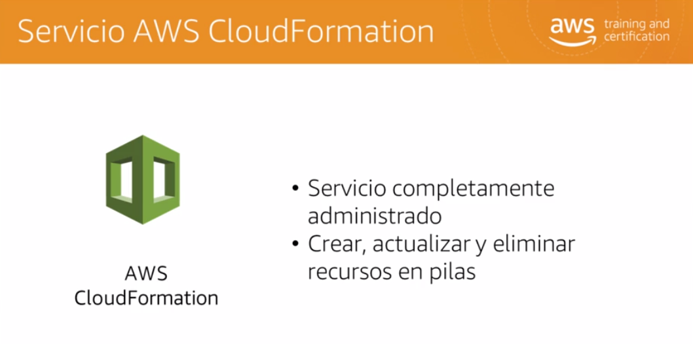

¿Cómo se controla CloudFormation? Regresamos a nuestras tres interfaces principales: la consola de administración de **AWS**, la CLI, o las llamadas a la API del SDK. Esto significa que puede interactuar con el servicio a través de la consola de administración o crear scripts para automatizar las acciones de **CloudFormation**. 

Hablemos un poco más sobre las **pilas**. Las **pilas** son los recursos generados por una plantilla, pero también son una unidad de implementación. Puede crear pilas, realizar actualizaciones volviendo a ejecutar una plantilla modificada e incluso eliminar pilas. Cuando elimina una pila, de forma predeterminada, se eliminan todos los recursos de la pila. 

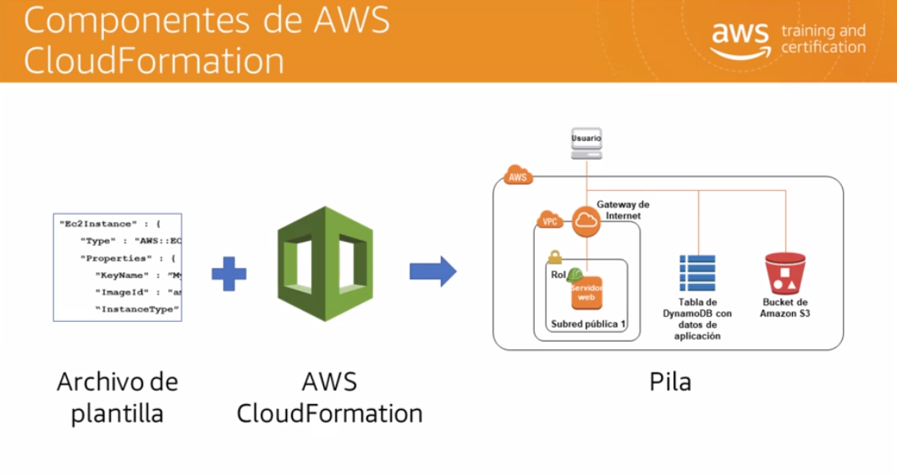

**Recuerde que es una unidad de implementación**. La mayoría de las organizaciones modularizan las pilas mediante la creación de plantillas independientes para redes, seguridad y aplicaciones. Examinemos las plantillas en mayor profundidad. Las plantillas describen los recursos que aprovisionarán. Son archivos de texto escritos en formato JSON o YAML. Como beneficio adicional, si a aprovisionó su entorno mediante plantillas, estas se convierten en una forma de documentación para el entorno.

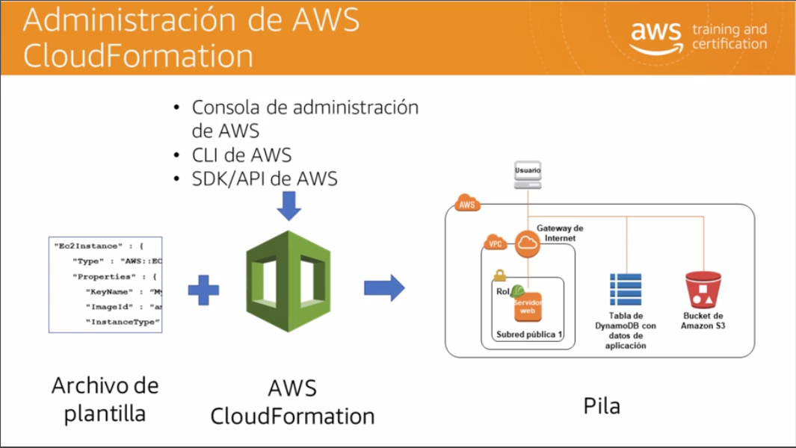

**¿Qué hay en un archivo de plantilla?** Es la misma información que especificaría si creara el entorno de modo manual a través de la consola. No es ningún secreto. La plantilla utiliza constructos de formato específicos, pero la información de recursos y propiedades es la misma. 

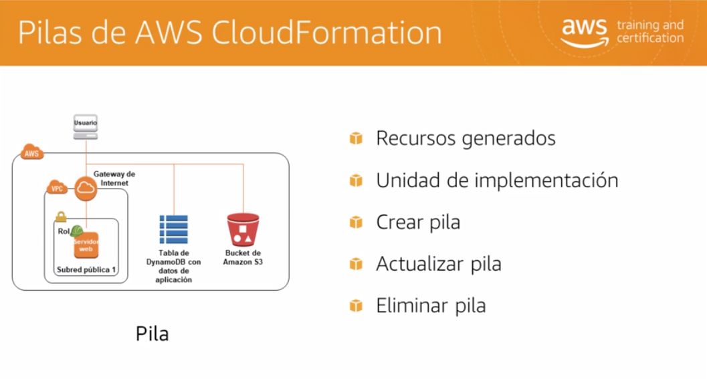

Un beneficio útil de **CloudFormation** es que no tiene que aumentar sus recursos en la plantilla en orden exacto de creación. Podemos utilizar el atributo de **DependsOn** a fin de controlar el orden en que **CloudFormation** creará los recursos, de modo que podamos construir una secuencia de eventos, como cuando es necesario crear un servidor de base de datos para que lo haga un servidor web.

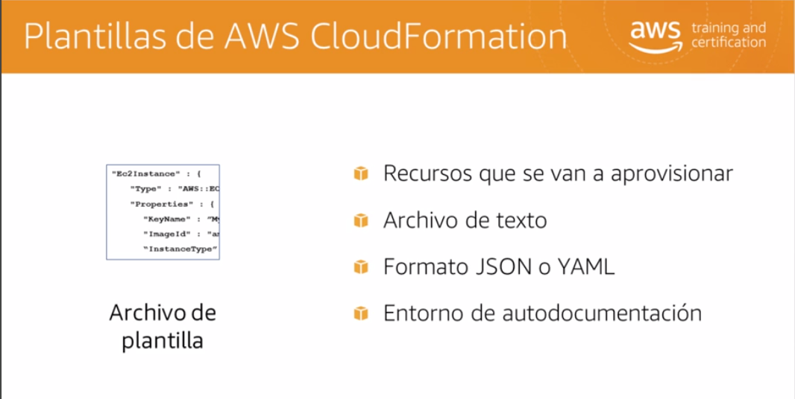

**¿Una plantilla solo sirve para crear un único entorno?** Si agrega parámetros y condiciones a la plantilla, puede utilizar la misma plantilla para crear diferentes entornos. Los parámetros son variables en una plantilla. Cuando ejecuta la plantilla a través de **CloudFormation**, debe completar los parámetros. Esto significa que si selecciona el parámetro uno, puede generar la pila de desarrollo, y el parámetro dos generará la pila de producción. De este modo, la plantilla es más flexible y funcional.

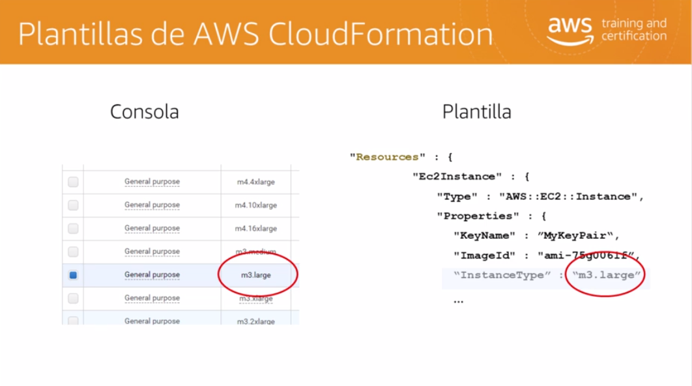

 **¿Qué sucede con todas estas plantillas que crea?** Cada plantilla es un ejemplo de infraestructura como código, lo que significa simplemente que usted controla la infraestructura a través de código de software. El software, como las plantillas, es flexible. Puede cambiarlo. También puede mantener diferentes versiones de la misma plantilla. Esto es exactamente lo que hacen los desarrolladores con el código fuente de las aplicaciones y cómo quiere tratar las plantillas.  Las organizaciones que dependen de **CloudFormation** crean bibliotecas de plantillas de modo similar a como crean repositorios de código para aplicaciones. 

Hay dos requisitos fundamentales para ejecutar **CloudFormation**. El primero, las plantillas; ya las hemos descrito. Si la plantilla tiene un error, de forma predeterminada **CloudFormation** dejará de procesar y revertir los objetos que ya se hayan creado a partir de la plantilla. 

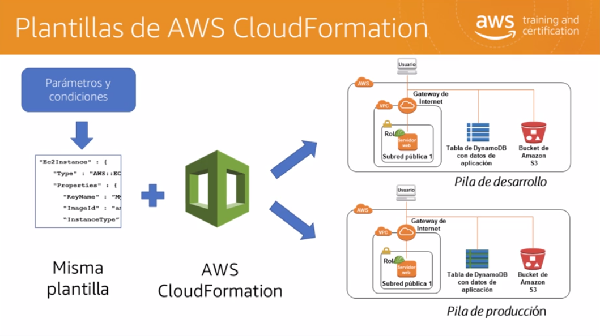

El segundo requisito para ejecutar información en la nube es que quién llama a la plantilla que se va a procesar debe tener permisos para todos los servicios a los que hace referencia en la plantilla. 

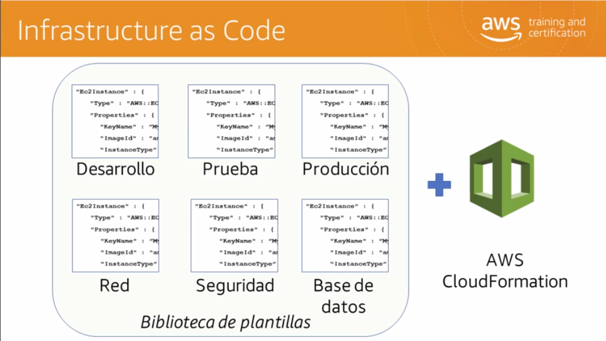

También puede controlar quién puede incluso procesar una plantilla de **CloudFormation**.

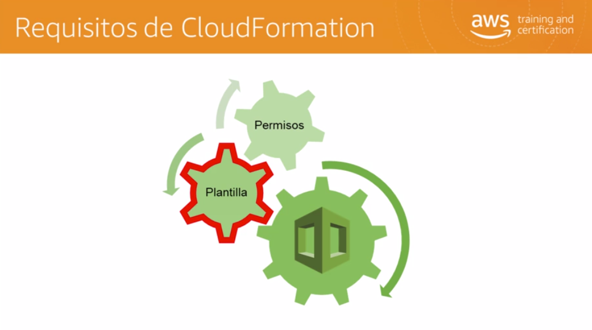

