# Módulo 4 - El Marco de la Buena Arquitectura de AWS

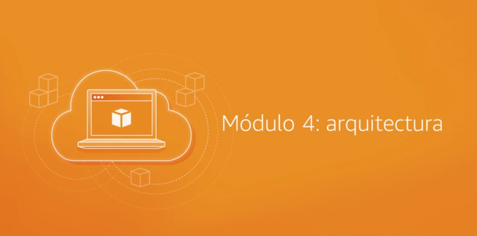

Arquitectura, este módulo se centra en consideraciones de arquitectura para la implementación en la nube de **AWS** o la migración a ella. El módulo abarca los aspectos fundamentales de una solución bien diseñada, analiza la tolerancia a errores y la disponibilidad, y completa una sección sobre el alojamiento web en la nube de **AWS**.

## El Marco de la Buena Arquitectura de AWS

En el capítulo de hoy, haré una breve introducción del **Marco de Buena Arquitectura**. El **Marco de Buena Arquitectura** de **AWS** sirve como ayuda para los clientes.

Ayuda a los clientes a evaluar y mejorar sus propias arquitecturas, a la vez que comprenden mejor cómo sus decisiones en torno al diseño pueden impactar en sus negocios. Los expertos de **AWS** han desarrollado una serie de preguntas para ayudar a los clientes a analizar en profundidad sus arquitecturas y a pensar de manera crítica sobre ellas. Ayuda para definir si su infraestructura sigue las prácticas recomendadas.

**AWS** ha desarrollado una guía para ayudarlo a diseñar su arquitectura desde cinco perspectivas o pilares diferentes.

Estos son los pilares:

- **seguridad**
- **fiabilidad**
- **eficacia del rendimiento** 
- **optimización de costos**
- **excelencia operativa**

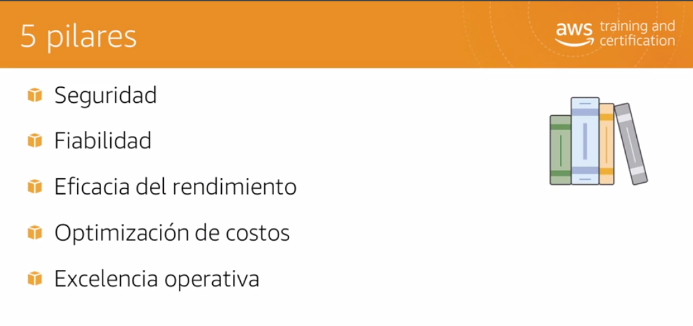

**Pilar de Seguridad**

Comencemos con el **pilar de seguridad**. El pilar de la seguridad incluye la capacidad de proteger la información, los sistemas y los activos, al tiempo que se otorga valor de negocio mediante evaluaciones de riesgo y estrategias de mitigación. Para profundizar un poco más este tema, la seguridad en la nube se compone en cinco áreas. Veamos brevemente cada una de ellas.

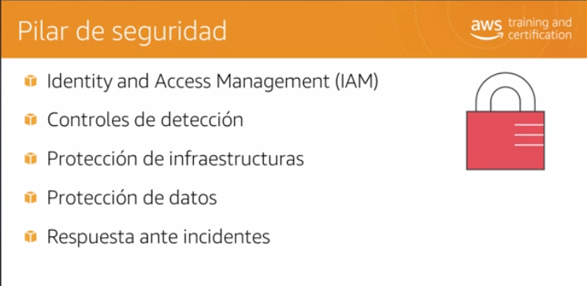

En primer lugar, **AWS Identity and Access Managament - IAM**. **IAM (Pilar de Seguridad)** es fundamental para garantizar que sólo los usuarios autorizados y autenticados puedan acceder a los recursos y sólo de la manera prevista. 

A continuación, veamos los **controles de detección (Pilar de Seguridad)**. Estos controles se pueden utilizar para identificar un posible incidente de seguridad mediante la consideración de algunos enfoques, como capturar o analizar registros, e integrar controles de auditoría.

Ahora, veamos la **protección de infraestructuras((Pilar de Seguridad))**. Está garantiza que los sistemas y servicios de la arquitectura estén protegidos contra el acceso no autorizado y no deseado. Por ejemplo, el usuario puede crear límites de red, aplicar endurecimiento y parches; niveles de usuarios, claves, acceso, y firewall o gateways de aplicaciones.

Veamos la **protección de datos (Pilar de Seguridad)**. En cuanto a ella, existen numerosos enfoques y métodos para tener en cuenta. Entre ellos, se incluyen la clasificación de datos, el cifrado, la protección de datos en reposo y en tránsito, la copia de seguridad de datos, y las replicación y recuperación cuando sea necesario.

Por último consideremos la **respuesta ante incidentes (Pilar de Seguridad)**. Incluso en todas las medidas de prevención y detección, las organizaciones aún deben crear un proceso respuesta a incidentes para responder ante cualquier posible incidente de seguridad y mitigarlo. La respuesta a incidentes garantiza que la arquitectura se actualice para adaptarse a una investigación y recuperación oportunas.

Cuando se crea una arquitectura, es importante tener en cuenta los siguientes principios de diseño que también ayudan a fortalecer la seguridad:

Este es el **primer principio de diseño**: Aplicar la seguridad en todas las capas. Quiere asegurarse de proteger su infraestructura en cualquier lugar y en cada capa. En un centro de datos físicos, la seguridad generalmente sólo se tiene en cuenta a nivel perimetral. **AWS** le permite implementarla tanto en el perímetro como en los recursos y entre ellos. Esto garantiza que el entorno y los componentes individuales también estén protegidos entre sí. Asimismo, queremos asegurarnos de que habilitamos la trazabilidad. Puede hacerlo mediante el registro y la auditoría de todas las acciones o cambios en su entorno.

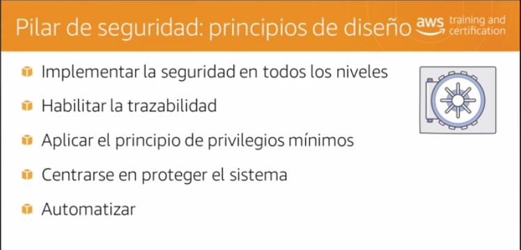

Otro principio de diseño útil es **implementar el elemento principal de mínimo privilegio**. Básicamente, quiere asegurarse de que la autorización en su entorno es adecuada y de que está implementando estrictos controles de acceso lógico en sus recursos de **AWS**.

A continuación, queremos asegurarnos de que se centra en proteger su sistema. Con el modelo de **responsabilidad compartida** de **AWS**, puede centrarse claramente en proteger los datos de aplicaciones y sistemas operativos mientras **AWS** proporciona infraestructura y servicios seguros.

El último principio de diseño que hay que recordar es **automatizar las prácticas recomendadas de seguridad**. Los mecanismos de seguridad basadas en software permiten mejorar la capacidad de escalar recursos de manera más segura, rápida y rentable.

Por ejemplo, se recomienda crear y guardar una imagen protegida y con parches de un servidor virtual. Más adelante, cuando necesite esa imagen, puede utilizar la misma imagen que ya estaba protegida y con parches para crear automáticamente una nueva instancia. Otra práctica recomendada es automatizar la respuesta a eventos de seguridad rutina y anómalos.

**Fiabilidad**

A continuación, nos dedicaremos al pilar de **fiabilidad**. El pilar de **fiabilidad** engloba la capacidad de un sistema para recuperarse de errores de infraestructura o servicio. También se centra en la capacidad de adquirir de forma dinámica los recursos informáticos para satisfacer la demanda y mitigar las interrupciones. El balance final es que la **fiabilidad** está ahí para ayudar en la capacidad de recuperarse de errores y satisfacer la demanda.

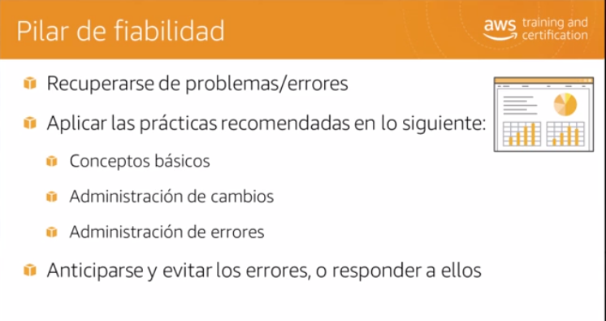

La **fiabilidad** en la nube se compone de tres áreas: base, administración de cambios y administración de errores. Para alcanzar la **fiabilidad**, la arquitectura y el sistema deben tener una base bien planificada que pueda administrar los cambios en la demanda o los requisitos, y también detectar errores y corregirse automáticamente. Antes de diseñar cualquier tipo de infraestructura y comenzar la construcción, es fundamental observar la base.
De modo similar a la nube, antes de diseñar la arquitectura de cualquier sistema, se deben definir los requisitos fundamentales que inciden en la **fiabilidad**. Con la administración de cambios, es importante comprender por ejemplo el modo en que los cambios pueden afectar el sistema.

Sí planifica de forma proactiva y monitorea el sistema, puede aceptar los cambios y adaptarse a ellos de manera rápida y confiable. Para garantizar la **fiabilidad** de la arquitectura, es fundamental anticipar los errores, conocerlos, responder a ellos y evitarlos. En un entorno de nube, puede aprovechar la automatización con monitoreo, reemplazar sistemas en el entorno y, posteriormente, solucionar problemas en sistemas con errores, todo a bajo costo y sin perder **fiabilidad**.

Veamos los principios de diseño de fiabilidad. Los principios de diseño que pueden aumentar la fiabilidad incluyen los procedimientos de recuperación de pruebas. En la nube, los usuarios pueden probar el modo en que los sistemas presentan errores y pueden validar los procedimientos de recuperación. Los usuarios pueden simular y exponer diferentes errores para actuar antes de que se produzca un error real.

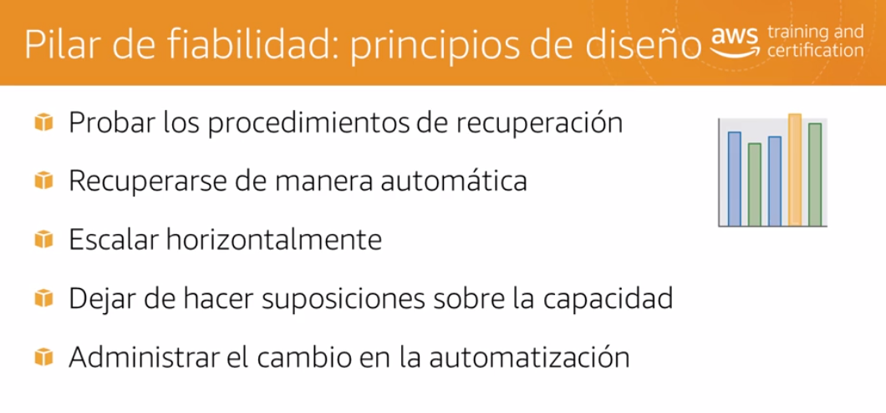

A continuación, analizaremos la recuperación de error automática. En **AWS**, los usuarios pueden activar respuestas automatizadas cuando se sobrepasan los umbrales. Esto posibilita anticipar los errores y solucionarlos antes de que se produzcan. Nuestro siguiente principio es escalar horizontalmente para aumentar la disponibilidad total del sistema. Cuando tiene un recurso grande, es provechoso reemplazarlo con varios recursos pequeños para reducir el impacto de un solo punto de error en el sistema general. El objetivo es escalar horizontalmente y distribuir los requisitos entre varios recursos pequeños.

El siguiente principio de diseño consiste en dejar de hacer suposiciones sobre la capacidad. En el entorno en la nube, tiene la capacidad de monitorear la demanda y la utilización del sistema, y automatizar la adición o eliminación de recursos. Esto garantiza que tenga el nivel óptimo para satisfacer la demanda sin aprovisionamiento excesivo o insuficiente.

Por último consideremos la administración de cambios y la automatización. Los cambios en la arquitectura e infraestructura deben realizarse mediante la automatización. Con esto, sólo necesita administrar los cambios en la automatización, no en todos los sistemas o recursos.

**Eficacia del Rendimiento**

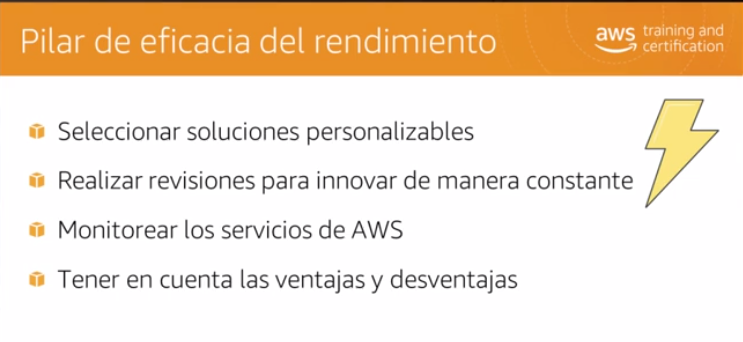

Ahora, veamos el pilar de eficacia del rendimiento. Las cuatro partes que componen el pilar de eficacia del rendimiento en la nube incluyen la:

- **selección** 
- **revisión** 
- **monitoreo**
- **soluciones inmediatas**

Con la selección; es importante elegir la mejor solución que optimice la arquitectura. Sin embargo, estas soluciones varían según el tipo de carga de trabajo que tenga. Con **AWS**, los recursos se virtualizan y le permite personalizar sus soluciones en diferentes tipos y configuraciones.

Con la revisión, puede innovar continuamente las soluciones y aprovechar las nuevas tecnologías y los enfoques disponibles. Cualquiera de estas nuevas versiones de productos podría mejorar la eficacia del rendimiento de su arquitectura.

En lo que respecta al monitoreo, una vez que haya implementado la arquitectura, deberá monitorear el rendimiento para asegurarse de que puede solucionar cualquier problema antes de que los clientes se vean afectados y sean conscientes de ellos.

Con **AWS**, puede usar la automatización y monitorear la arquitectura con herramientas como **Amazon CloudWatch**, **Amazon Kinesis**, **Amazon Simple Queue Service - Amazon SQS** y **AWS Lambda**. Por último están las soluciones intermedias. Un ejemplo de solución intermedia que garantiza un enfoque óptimo es cambiar consistencia, durabilidad y espacio por tiempo o latencia para ofrecer mejor rendimiento.

Identifiquemos los principios de diseño que pueden ayudarlo a obtener eficacia del rendimiento.

Primero, democratice las tecnologías avanzadas. Las tecnologías que son difíciles de implementar pueden volverse fáciles de utilizar si deja los conocimientos correspondientes y la complejidad en manos del dominio del proveedor de servicios en la nube. En lugar de hacer que el equipo de TI aprenda a alojar y ejecutar tecnología nueva, simplemente puede utilizarla como servicio.

A continuación, veamos cómo se puede pasar a ser global en minutos. Con **AWS**, puede implementar fácilmente su sistema en varias regiones del mundo a la vez que proporciona menor latencia y mejor experiencia para sus clientes a un costo mínimo.

El siguiente principio de diseño que puede ayudarlo a lograr eficacia del rendimiento es utilizar una arquitectura sin servidor. En la nube, esto le permite eliminar la necesidad de ejecutar y mantener servidores tradicionales para las actividades de cómputo. También se elimina la carga operativa, y se puede reducir los costos de transacción. Otro principio de diseño consiste en experimentar con mayor frecuencia. Con la virtualización puede realizar pruebas rápidamente para mejorar la eficacia.

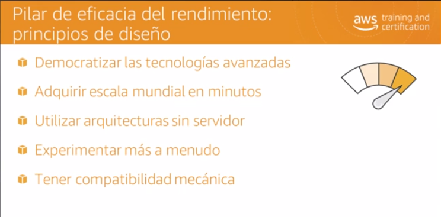

Por último, consideremos la compatibilidad mecánica. En este principio, se recomienda utilizar el enfoque tecnológico que mejor se adapte con lo que intenta lograr.

**Optimizar Costos**

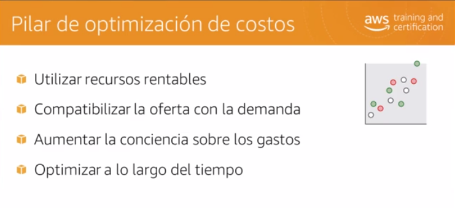

El siguiente pilar es el de **optimizar costos**, que incluye el proceso continuo de perfeccionamiento y mejora de un sistema a lo largo de todo su ciclo de vida. Este pilar engloba la idea de que puede crear y operar sistemas con control de datos y maximizar el retorno de la inversión. 

Las cuatro áreas que conforman el pilar de optimización de costos son los recursos rentables, la correspondencia entre oferta y demanda, la conciencia del gasto y la optimización en el tiempo.

Un sistema totalmente optimizado en costos utilizará todos los recursos para lograr el mejor resultado al precio más bajo posible, a la vez que cumple con los requisitos funcionales. Asegurarse de que los sistemas utilizan los servicios, los recursos y las configuraciones adecuadas es una de las partes clave para ahorrar costos. Como usuario, quiere centrarse en los detalles, como el aprovisionamiento, la modificación de tamaño, las opciones de compra y otros detalles específicos a fin de garantizar que dispone de la mejor arquitectura para sus necesidades.

Otro componente de la optimización de costos es la correspondencia entre la oferta y la demanda. Con la nube de **AWS**, puede aprovechar la elasticidad de la arquitectura en la nube para satisfacer las demandas a medida que cambian. Puede escalar de forma automática y recibir notificaciones de otros servicios con el fin de regular el suministro debido a cambios en la demanda. 

También está en la conciencia de los gastos. Es fundamental tener plena conciencia y conocimiento de los generadores de gastos y costos de su negocio, por lo que la capacidad de ver, comprender y desglosar los costos actuales, predecir los costos futuros y planificar en consecuencia sólo aumenta la optimización de costos de su arquitectura en la nube. 

Por último, en **AWS**, la optimización es posible a lo largo del tiempo. Con todas las herramientas y los diferentes enfoques disponibles, puede medir, monitorear y mejorar la arquitectura a partir de los datos que recopiló en la plataforma **AWS**.

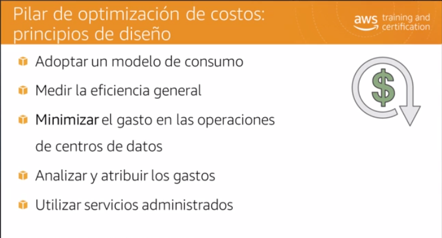

Analicemos los principios de diseño de optimización de costos. El primer principio es adoptar un modelo de consumo. Con el modelo de consumo, paga sólo por los recursos informáticos que utilizan y luego paga más o menos en función de los requisitos del negocio.

El siguiente principio consiste en medir la eficiencia general. Es importante medir el resultado empresarial de los sistemas y los costos asociados a su entrega y, luego, tomar esta medida para comprender cómo se obtienen beneficios con el aumento de la producción y la reducción de Los costos.

El siguiente principio de diseño tiene que ver con dejar de gastar dinero en las operaciones del centro de datos. Con **AWS**, ya no tiene que ocuparse de las cargas pesadas de apilar los servidores, organizarlos en bastidores y alimentarlos. Realizamos ese trabajo para que pueda centrarse completamente en sus clientes y proyectos comerciales en lugar de la infraestructura de TI.

El siguiente principio de diseño consiste en analizar y asignar los gastos. Con la nube, es mucho más simple y fácil identificar con precisión el uso y el costo de los sistemas. Los clientes pueden medir el retorno de la inversión, lo que les da la oportunidad de optimizar los recursos y reducir los costos.

Por último, recomendamos que los clientes utilicen series administradas para reducir el costo de propiedad. La nube ha proporcionado muchos servicios administrados a fin de eliminar la carga operativa que supone mantener servidores para tareas como el envío de emails o la administración de bases de datos. Como todo esto se realiza en la nube, pueden ofrecer un costo más bajo por transacción o servicio.

**Excelencia Operativa**

El siguiente pilar es la **excelencia operativa**. Este pilar se concentra en la ejecución y el monitoreo de los sistemas para proporcionar valor de negocio y mejorar constantemente los procesos y procedimientos. Entre las ideas clave del pilar de excelencia operativa, se incluyen la administración y automatización de los cambios, la respuesta a eventos y la definición de estándares para administrar correctamente las opciones diarias.

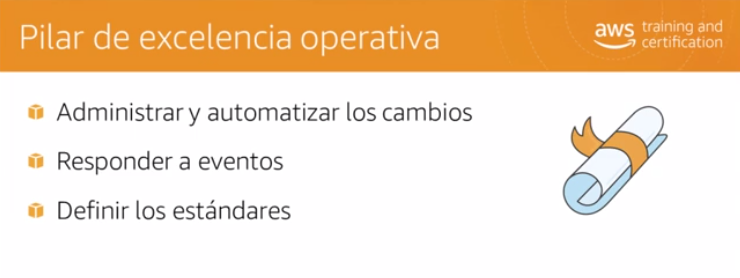

Revisemos los temas que hemos visto hoy. El **Marco de Buena Arquitectura** de **AWS** se a desarrollado para ayudar a los clientes a evaluar y mejorar sus propias arquitecturas, a la vez que proporcionan mejor el modo en que sus decisiones en torno al diseño pueden impactar en sus negocios. Revisamos los pilares que componen el **Marco de Buena Arquitectura** de **AWS**: 
- seguridad
- fiabilidad
- eficiencia del rendimiento
- optimización de costos
- excelencia operativa

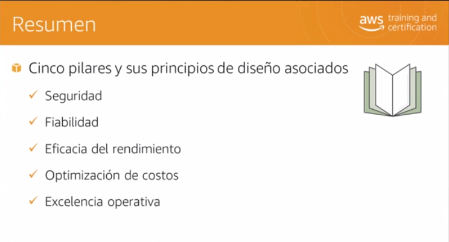