# Módulo 5 - Introducción a los recursos de seguridad de AWS

Seguridad, en este módulo se dará una introducción a la seguridad cuando se trabaja en la nube de **AWS**. Presenta el modelo desde responsabilidad compartida y abarca algunas herramientas que ayudan a proteger su entorno en la nube.

Hoy hablaremos de la seguridad de **AWS**.

**AWS** proporciona una plataforma escalable de informática en la nube escalable que está diseñada para ofrecer alta disponibilidad y fiabilidad, con herramientas que le permiten ejecutar una amplia gama de aplicaciones. Además de mantener su confianza, para **AWS** es de suma importancia ayudar a proteger la confidencialidad, integridad y disponibilidad de los sistemas y los datos de los clientes.

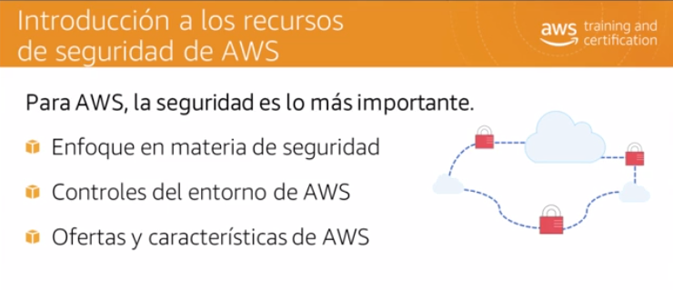

El fin de este módulo es presentar el enfoque de seguridad de **AWS**, incluidos los controles en el entorno de **AWS** y algunos productos y características que **AWS** ofrece a sus clientes para que puedan alcanzar los objetivos de seguridad.

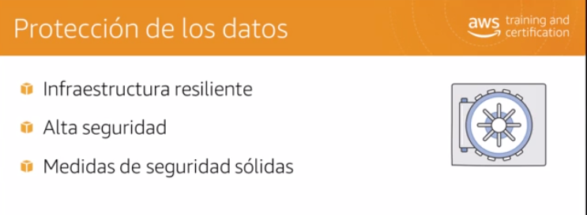

Todos los clientes de **AWS** se benefician de un centro de datos y una arquitectura de red diseñados para satisfacer los requisitos de nuestros clientes más exigentes en materia de seguridad. Esto significa que obtiene una infraestructura resistente, diseñada para ofrecer un alto nivel de seguridad, sin la inversión de capital ni la sobrecarga operativa de un centro de datos tradicional. La infraestructura de **AWS** implementa medidas de seguridad eficientes para proteger la privacidad de los clientes.

**AWS** innova con rapidez a gran escala, ya que incorpora continuamente los comentarios de los clientes en los servicios de **AWS**. Esta mejora continua beneficia a todos los clientes por qué las soluciones de **AWS** se perfeccionan con el tiempo, incluidos los servicios de seguridad principales en constante evolución, como **Identity and Access Management**, el registro y el monitoreo, el cifrado y la administración de claves, la segmentación de red y la protección DDoS estándar, por un costo adicional bajo o nulo.

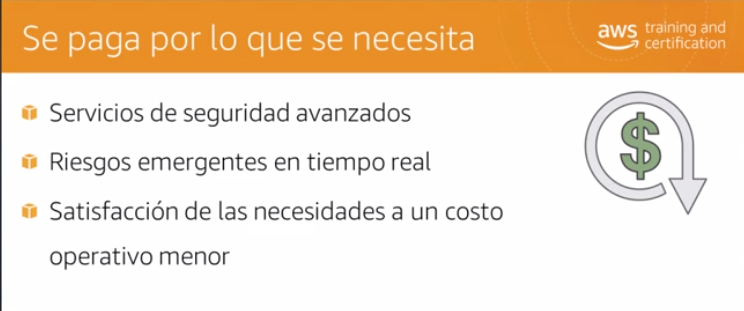

También obtiene servicios de seguridad avanzados que diseñan ingenieros con un gran conocimiento sobre las tendencias de seguridad globales. Esto le permite a su equipo abordar de forma proactiva los riesgos emergentes en tiempo real y pagar sólo por lo que utiliza, todo a un costo más bajo. Esto significa que puede elegir la seguridad que se adapte a sus necesidades a medida que crece, sin gastos iniciales y con una sobrecarga operativa mucho menor en comparación con la que resultaría de la administración de su propia infraestructura. 

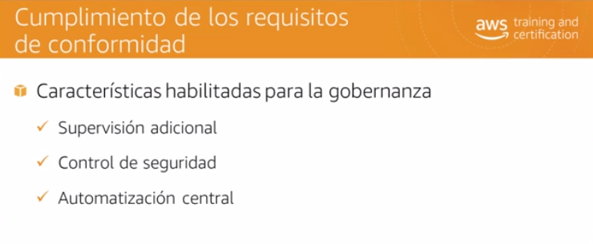

Un entorno debidamente protegido es también uno con conformidad. Cuando migra sus cargas de trabajo reguladas en la nube de **AWS**, puede lograr un nivel más alto de seguridad a gran escala mediante el uso de las numerosas características de activación de la gobernanza. La gobernanza basada en la nube ofrece un menor costo de entrada, operaciones más sencillas y mayor agilidad por qué proporciona más supervisión, control de seguridad y automatización central.

Si utiliza a **AWS**, hereda numerosos controles de seguridad que **AWS** opera, lo que reduce la cantidad de controles de seguridad que debe mantener.

Sus propios programas de conformidad y certificación se fortalecen y, al mismo tiempo, reducen el costo de mantener y ejecutar los requisitos específicos de garantía de seguridad.

**AWS** y sus socios ofrecen una amplia gama de herramientas y características para ayudarlo a satisfacer los objetivos de seguridad. Estas herramientas unen los controles conocidos que implementa en su propio entorno local.

**AWS** proporciona herramientas y características específicas de seguridad que incluyen la seguridad de red, la administración de la configuración, el control de acceso y la seguridad de datos. Además, **AWS** ofrece herramientas de monitoreo y registro para proporcionar una visibilidad completa de lo que sucede en su entorno. **AWS** proporciona varias capacidades y servicios de seguridad para mejorar el nivel de privacidad y controlar el acceso a las redes. Se incluyen los firewall integrados que le permiten crear redes privadas en **AWS**; el acceso de red de control a sus instancias y subredes; el cifrado en tránsito con Transport Layer Security en todos los servicios; opciones de conectividad que permiten conexiones privadas o dedicadas desde su oficina o entorno local; y tecnologías de mitigación de DDoS como parte de la estrategia de entrega de contenido o **Auto Scaling**.

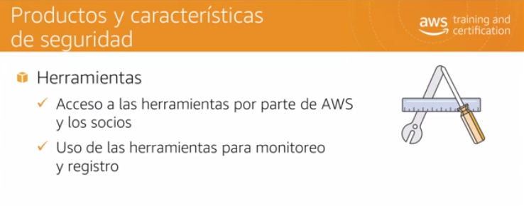

**AWS** ofrece una gama de herramientas que le permiten avanzar rápidamente mientras se asegura de que sus recursos en la nube cumplan con los estándares y las prácticas recomendadas de la organización. Entre estas se incluyen herramientas de implementación para mantener la creación y la baja de recursos de **AWS** de acuerdo con los estándares de la organización; herramientas de administración del inventario y de la configuración para identificar los recursos de **AWS** y, luego realizar un seguimiento de los cambios en dichos recursos a lo largo del tiempo y administrarlos; y herramientas de definición y administración de plantillas orientada a la creación de máquinas virtuales (VM) estándar, protegidas y preconfiguradas para instancias de **Amazon EC2**.

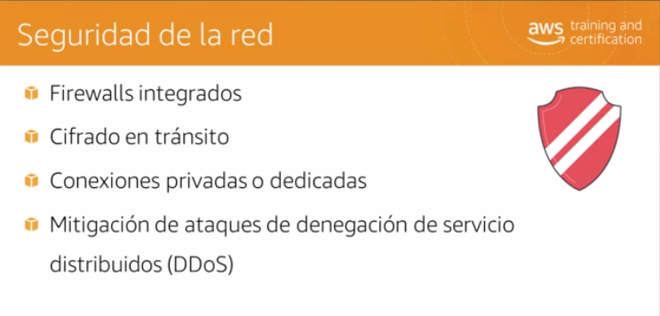

**AWS** le ofrece la posibilidad de agregar una capa de seguridad a sus datos en reposo en la nube mediante el suministro de características de cifrado escalables y eficientes. Entre ellas se incluyen las capacidades de cifrado de datos disponibles en los servicios de base de datos y almacenamiento de **AWS**, como Amazon EBS, Amazon S3, Amazon Glacier, Oracle RDS, SQL Server RDS y Amazon RedShift; opciones de administración de claves flexibles que le permiten elegir si AWS administra las claves de cifrado o si usted mantiene un control completo sobre las claves; y opciones de almacenamiento de claves criptográficas dedicadas basadas en hardware para que los clientes puedan cumplir los requisitos de conformidad.

Además **AWS** proporciona diversas API para que pueda integrar el cifrado y la protección de los datos en cualquiera de los servicios que desarrolle o implemente en un entorno de AWS.

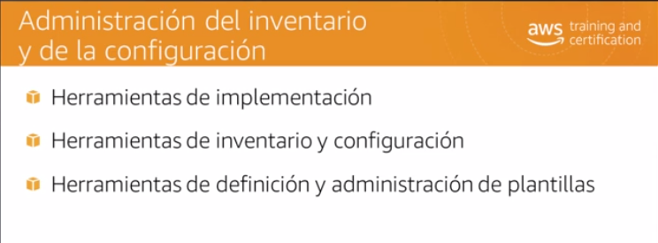

**AWS** le ofrece capacidades para definir, hacer cumplir y administrar las políticas de acceso de los usuarios en los servicios de AWS. Estas incluyen las capacidades de **Identity and Access Management** orientadas a definir cuentas de usuarios individuales con permisos en los recursos de AWS; Multi-Factor Authentication (MFA) para cuentas privilegiadas, incluidas las opciones de autenticadores basados en hardware; en la integración y federación con directorios corporativos a fin de reducir la sobrecarga administrativa y mejorar la experiencia del usuario. AWS ofrece la integración nativa a **Identity and Access Management** en muchos de sus servicios, además de la integración de la API a cualquier aplicación o servicio propio.

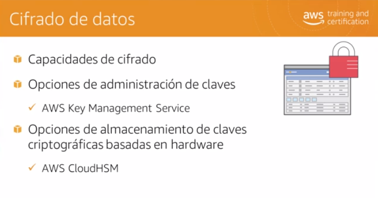

AWS proporciona herramientas y características que permiten ver exactamente lo que sucede en su entorno AWS. Estás consisten en una visibilidad detallada de las llamadas a la API que implica identificar quién realizó las llamadas y cuáles fueron, además de cuando y desde donde se realizaron; la agregación y las opciones de registro, la simplificación de las investigaciones y los informes de conformidad; y las notificaciones de alerta cuando se producen eventos específicos o se superan umbrales. Estas herramientas y características dan la visibilidad necesaria para identificar problemas antes de que afecten a la empresa y permiten mejorar el plan general de seguridad y reducir el perfil de riesgo del entorno. 

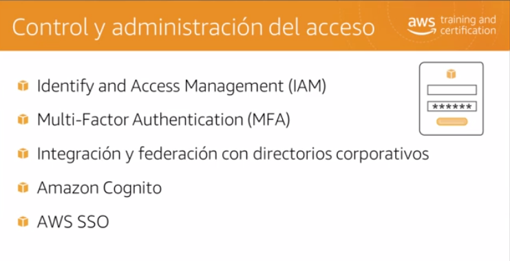

AWS Marketplace ofrece cientos de productos de socios líderes en sus sectores que son equivalentes o idénticos a los controles existentes de sus entornos locales o se integran con ellos, incluidos los firewalls de aplicación web, las soluciones para protegerse contra software malicioso, y la protección contra intrusiones. Estos productos complementan las herramientas y características que ofrece AWS para permitirle implementar una arquitectura de seguridad completa y una experiencia más continua entre sus  entornos en las instalaciones y en la nube.

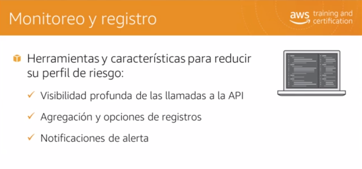

Además de mantener su confianza, para AWS es de suma importancia ayudar a proteger la seguridad de los sistemas y los datos de los clientes. 

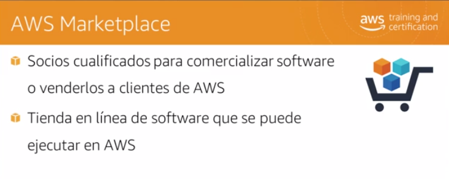