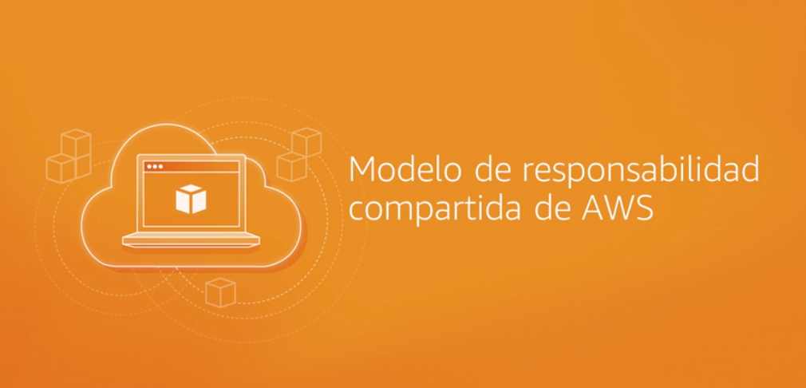
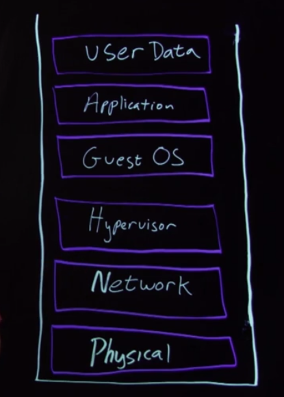

# Módulo 5 - El modelo de responsabilidad compartida

Cuando la aplicación se ejecuta en AWS, en algún momento, alguien tiene que ser responsable de protegerla. ¿Es A) usted o B) AWS? La respuesta correcta es C) Todas las opciones anteriores. Es necesario que ambas partes, tanto usted como AWS, trabajen juntas para proteger toda su aplicación. Ahora, cualquier buen administrador de seguridad le dirá que no puede haber dos empresas diferentes que protegen el mismo objeto ya que, en realidad, en ese caso, no tiene **seguridad**; sino **sugerencias**. Estamos de acuerdo. Por eso, en AWS, tenemos lo que denominamos **“Modelo de responsabilidad compartida”**. Vemos la pila de aplicaciones en su totalidad y la dividimos en diferentes partes. AWS es responsable del 100% de algunas de esas partes. El cliente es responsable del 100% de otras partes. Comprender dónde se encuentra esa división forma parte de la interacción entre ustedes y AWS.

Veamos cómo funciona la pila desde un punto de vista simplificado. Comenzamos en la parte inferior de la pila, en el nivel físico. Esto es hierro y concreto. Es una cerca de púas. Alguien tiene que administrar el aparcamiento. Alguien tiene que administrar los dispositivos físicos. Es AWS. No proporcionamos visitas a nuestros centros de datos. No concedemos ningún tipo de acceso como parte de nuestra manera de proteger el lado físico. Además del aspecto físico, ejecutamos la red de AWS, protocolos de redes patentados diseñados para permitir la seguridad de los sistemas, de modo que los elementos, como la nube virtual privada (Amazon VPC), puedan funcionar a gran escala y con velocidad. Todo ello está diseñado para proteger el tráfico. ¿Cómo protegemos esto? Nuevamente, no se lo contamos como parte de la seguridad.

Ahora, si en este momento piensa que no estoy contando muchas cosas... lo entiendo. Sin embargo, aunque no podamos decirle exactamente lo que hacemos, se lo hemos indicado de forma específica a los auditores.

Si simplemente consulta [**compliance**](https://aws.amazon.com/es/compliance), verá una serie de auditorías de terceros que han experimentado la pila de red o los elementos físicos, y lo hacen con frecuencia actualmente. De este modo, obtiene información muy rigurosa de que, cuando decimos que nuestra red es segura, alguien distinto de Amazon lo ha experimentado, alguien en quien puede confiar y que explica cómo se ha hecho. 

Además de nuestra red, tenemos el hipervisor. Ahora, si revelamos que el hipervisor de AWS utiliza un hipervisor basado en XEN. Dicho esto, hemos realizado muchos cambios específicos en el hipervisor que lo hacen seguro y escalable para que podamos ejecutar un millón de clientes simultáneos sin preocuparnos por la filtración de datos.

Además del hipervisor, si ejecuta EC2, hay una línea divisoria mágica que separa el sistema operativo invitado del hipervisor en Amazon Elastic Compute Cloud (Amazon EC2) y, en este caso, usted elige el sistema operativo. Puede elegir Linux o Windows, la opción que quiera, y elegir las aplicaciones que se ejecutan. Por encima de esta línea, AWS no tiene visibilidad. No hay nada que podamos hacer para ver lo que ocurre en su sistema operativo.  No conocemos su aplicación y, por ende, no tenemos idea de sus datos de usuario. Es contenido totalmente protegido por sus combinaciones de claves secretas de clave de acceso y sus métodos de cifrado. No podríamos leerlo si quisiéramos. De hecho uno de los mitos de la nube es que AWS intenta obtener su información, como en el pasado lo hacían algunos proveedores de email, para luego vendérsela a altos costos. Y, aunque es posible que haya un administrador de marketing en amazon.com que quisiera esa información, por el diseño de nuestra arquitectura, no podría acceder a ella por más que se le permitiera hacerlo. Simplemente, es imposible de leer.

Por lo tanto, AWS es responsable del 100% de lo que esté por debajo de la línea, y usted es responsable del 100% de lo que esté por encima de la línea.