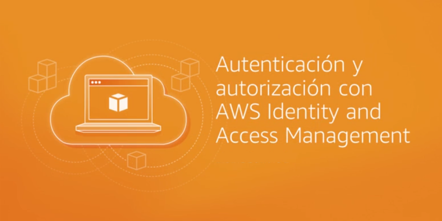
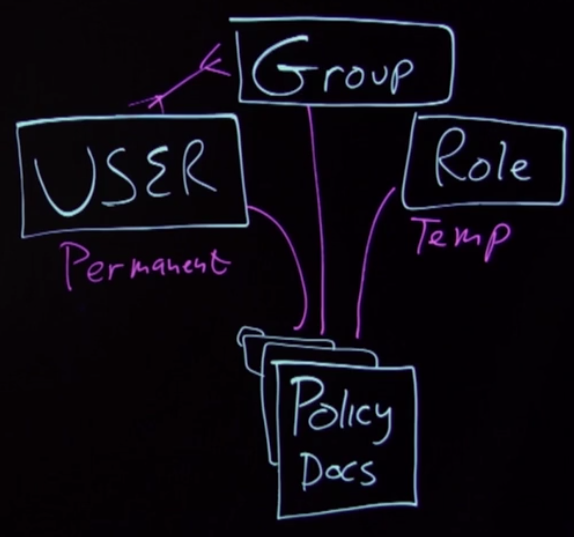

# Módulo 5 - Identity and Access Management (IAM)

Comprender cómo funcionan los permisos en AWS implica entender cómo funciona **Identity and Access Management**, o **IAM**, desde adentro. El problema de **IAM** es el uso de las palabras. Existen palabras que significan cosas obvias; sin embargo, internamente, estas palabras pueden significar cosas completamente diferentes en función de quién las utilice y del contexto en que se utilicen. Estas son palabras como **usuario** y **grupo**, y palabras de **roles** que resultan muy familiares y qué significan lo que cree que significan. Pero desde el punto de vista de IAM, queremos ser extremadamente específicos, así que veamoslas.

**Usuario**

Comenzamos con el concepto de **usuario**. ¿Qué es un usuario? En el caso de AWS IAM, nos referimos a un operador designado permanentemente. Podría ser humano, podría ser una máquina. No importa lo que sea. La idea es que mis credenciales sean permanentes y permanezcan con ese usuario designado hasta que haya una rotación forzada, tanto que sí es un nombre y una contraseña, una clave de acceso, una combinación de clave secreta o lo que sea. Este es mi **método de autenticación** para los usuarios designados del sistema.

**Grupo** 

Ahora bien, ¿qué es un grupo? En este momento, la respuesta debería ser obvia. Un grupo es un conjunto de usuarios. Los grupos pueden tener muchos usuarios, los usuarios pueden pertenecer a muchos grupos... 

**Rol**

¿Qué es un rol? Aquí es donde resulta importante comprender el punto de vista de IAM, porque, en AWS IAM, **un rol no son sus permisos**. **Un rol es un método de autenticación**. Un usuario es un operador podria ser humano, podría ser una máquina. La clave es que se trata de un conjunto **permanente** de credenciales. **Un rol es un operador**. Podría ser humano, podría ser una máquina. La parte clave es que las credenciales con un rol son **temporales**. En cualquier caso, nos enfocamos en el **método de autenticación** de su usuario y su operador.

Todo en AWS es una API. Esto es fundamental. También significa que para ejecutar la API, primero tenemos que realizar la autenticación, pero luego, la autorización. El rol no se refiere a permisos. Es simplemente la autenticación. Los permisos, en todos los casos, se producen en un objeto independiente conocido como el **documento de política**.

**El documento de política**

El documento de política es un documento JSON. Se asocia directamente a un usuario designado permanente o a un grupo de usuarios, o se puede asociar de modo directo a un rol. El documento de política enumera la API específica o el grupo comodín de API qué incluyo en una lista blanca, o permito, ¿para qué recursos? ¿es para cualquier recurso de la cuenta? ¿es para un subconjunto específico? ¿existen determinadas condiciones? ¿deseo permitirlo solamente si estoy en la red doméstica? ¿o si estoy conectado a una VPC? ¿o lo acepto desde cualquier ubicación? ¿algunos momentos del día? Es posible que tenga operadores que solo puedan realizar funciones. Todos estos se convierten en elementos que son parte del documento de política. 

Aquí se muestra como una llamada a la API pasa por un proceso a medida que estos elementos se asocian. Supongamos, por ejemplo, que un operador quiere colocar un objeto en un **bucket** de **S3**. Eso implica una llamada a la API, por lo que para ello, ejecuta la API, coloca el objeto en **S3**,  asigna un nombre al **bucket**, asigna un nombre al objeto y presenta un conjunto de credenciales, ya sea una clave de acceso secreta, o el nombre de usuario y la contraseña que utiliza para iniciar sesión en la consola. Todo eso es la instrucción de ejecución de la API. Se presenta al motor de la API de AWS. Lo primero que hace el motor de IAM es examinar esas credenciales, el nombre de usuario y la contraseña y la clave de acceso secreta, y validar que sean credenciales de autorización **activas**. Eso valida que este es el usuario, el operador permanente, o quizá sea el rol de desarrollador del proyecto 17 o el grupo de administradores, que podría tener muchos usuarios en él. De cualquier forma, esas credenciales luego se aprueban, y aceptamos que usted es el operador que dice ser.

A continuación, tomamos dos documentos de política asociados a ese operador (el usuario, el grupo de usuarios o el rol) y evaluamos todos los documentos de política como una vista única. Vemos si la acción que está realizando (en este caso, el objeto PUT en S3) está autorizada por cualquiera de los documentos de política. Si lo está, es genial. Puede ejecutar la API.

Ahora, un documento de política también podría tener una denegación explícita. Esto anula cualquier declaración de permiso. Si no tiene un permiso, hay una denegación implícita. Al menos tengo que incluir una función en la lista blanca para que ocurra, pero con una lista negra, con una denegación explícita, no importa si tengo declaraciones de permiso. Puedo utilizarla cuando quiero evitar que se produzcan determinadas acciones de forma permanente. Supongamos por ejemplo, que no quiero que nadie pueda detener o terminar activos en un entorno de producción. Puedo crear un documento de política que deniegue la detención de EC2... la terminación EC2 frente a la producción de recursos, y asociarlo a todos los grupos, los usuarios y los roles porque la política de denegación evitaría que se ejecute la instrucción, autenticación y autorización.

También se resuelve el problema adicional si hay un conjunto de credenciales vulnerado. Si, por ejemplo, mi cuenta personal, por el motivo que sea, fuera descuidado con la administración de contraseñas. Quizás dejé que mi hijo utilizará mi portátil y él descargó un virus, y alguien consiguió un registrador de claves y obtuvo mi nombre de usuario y contraseña, y no utilizo la autenticación multifactor. (Estas dos cosas nunca ocurren en mi sistema, pero supongamos que sí). En ese caso, un pirata informático malintencionado en algún lugar tiene mi nombre de usuario y contraseña de administrador y, por ende, acceso a todos los documentos de política asociados a ese usuario permanente. El pirata informático, cuando descubre que tiene las llaves del reino, envía a la empresa una nota de rehén muy desagradable y amenazante en que se expresa: “Será mejor que transfiera un montón de bitcoins o comenzaré a eliminar los activos” y, de hecho, realmente elimina algunos para demostrar su punto. La empresa está en pánico. ¿Ahora qué hacemos? Si utiliza documentos de políticas asociados a usuarios y no emplea credenciales de nivel raíz, en este momento, el administrador de seguridad, que no sabe que cuenta se ha visto vulnerada, puede ejecutar una única instrucción de API que elimine los documentos de política de todos los usuarios, grupos y roles en una sola acción.

Ahora el secuestrador, tras no obtener un montón de bitcoins, intenta demostrar su punto y eliminar más activos porque quiere los bitcoins. Así es cómo se resuelve la acción de la API. El secuestrador envía la API con las credenciales del dueño y ordena eliminar el objeto S3. El motor de IAM evalúa la API. El motor de IAM acepta que es el dueño. Son el nombre de usuario y la contraseña correctos. Luego de revisar los documentos de política adjuntos que se han eliminado de la cuenta. Ya no están asociados al dueño, lo que significa que no, el dueño no puede eliminar documentos, pero gracias por intentarlo. Por cierto, en AWS CloudTrail, registraremos que intentó eliminar, porque todas las acciones de la API se registran en CloudTrail, se hayan realizado correctamente o se hayan rechazado. **Autenticación** y **Autorización**. Si comprende esta distinción, puede agregar una potencia y seguridad importantes a sus operaciones en AWS.