# Módulo 5 - AWS Shield

En este módulo, aprenderá sobre AWS Shield y las valiosas opciones de protección disponibles.

AWS Shield es un servicio administrado de protección contra ataques de denegación de servicio distribuidos (DDoS) que protege las aplicaciones ejecutadas en AWS. El servicio ofrece una detección permanente y mitigaciones automáticas en línea que reducen el tiempo de inactividad y latencia de las aplicaciones, así que no hay necesidad de contratar AWS Support para disfrutar de la protección de DDoS.

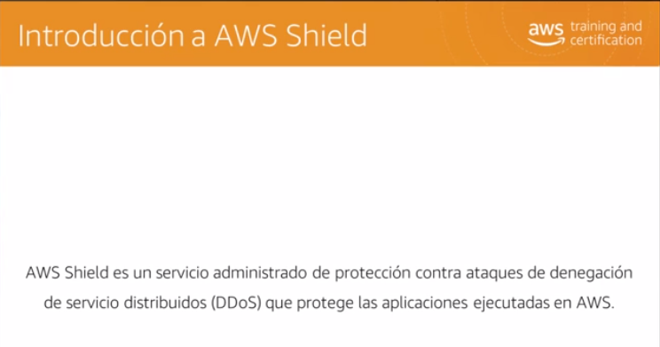

Antes de continuar, revisemos la diferencia entre los ataques DDoS y los ataques de denegación de servicio (o DoS). 

Un ataque DoS es un intento deliberado de hacer que su sitio web o aplicación no estén disponibles para los usuarios, por ejemplo, mediante la inundación con tráfico de red. Los atacantes utilizan diversas técnicas que consumen grandes cantidades de ancho de banda de red o asocian otros recursos de sistema, lo que interrumpe el acceso de los usuarios legítimos.

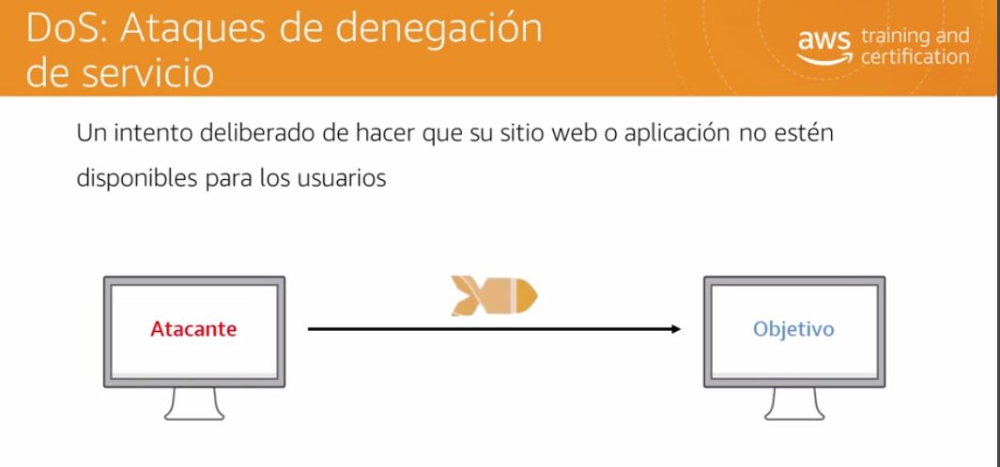

Como método más sencillo, un atacante solitario utiliza una única fuente para ejecutar un ataque DoS contra un objetivo. 

En un ataque de DDoS, un atacante utiliza varias fuentes para organizar un ataque contra un objetivo. Las fuentes pueden incluir grupos distribuidos de equipos, routers y dispositivos IoT infectados por software malicioso, y otros puntos de enlace.

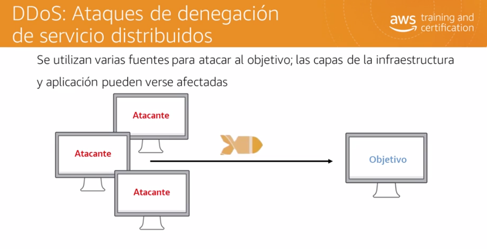

Los dos ataques DDoS suelen lanzarse desde un botnet de equipos o dispositivos de internet vulnerados. El objetivo es desconectar el sitio web o la aplicación de destino durante un período, lo que interrumpe la disponibilidad para los usuarios legítimos.

A veces, un atacante intenta derribar un sitio web mediante la forma en que el sitio se comunica con otros sitios. Esto se denomina “capa de aplicación”. Las capas de aplicaciones no suelen tener volúmenes de tráfico muy grandes.

Un ataque a la capa de aplicación con un nivel alto de focalización puede afectar una página web, con menos de 100 solicitudes por segundo. Los clientes utilizan firewalls de aplicación web (o WAF) para bloquear estas solicitudes antes de que lleguen a la infraestructura del servidor web.

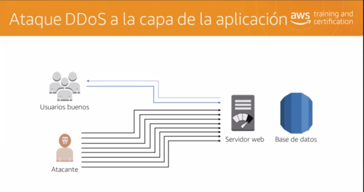

La mitigación de los ataques DDoS son desafiante. Por ejemplo:

- La protección es compleja de configurar y, a menudo implica diseñar la arquitectura de las aplicaciones.
- Sí opta por abordar la mitigación desde un centro de datos en las instalaciones, pueden producirse limitaciones de ancho de banda debido a problemas de escalabilidad.
- Un ataque requeriría intervención manual para que los operadores iniciarán la mitigación y los proveedores y equipos de mitigación redireccionaran el tráfico mediante una ubicación de limpiezas remota.
- A su vez esto demora la resolución y aumenta la latencia de la red.
- Debido al tamaño, la duración y la naturaleza compleja de los sistemas de mitigación, puede tomarse un costo prohibitivo.

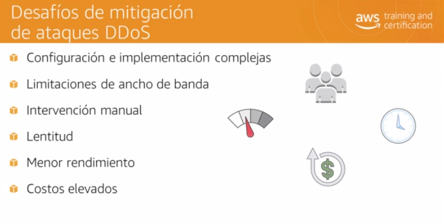

AWS Shield puede ayudarlo a superar estos desafíos.

El servicio ofrece dos opciones de protección:

- AWS Shield Standard 
- AWS Shield Advanced

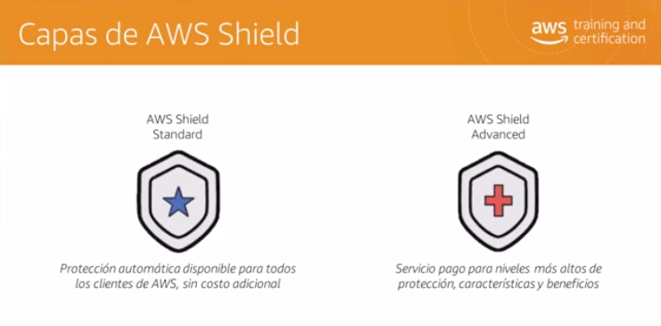

La versión estándar proporciona protección automática a todos los clientes de AWS sin cargo adicional.

La versión avanzada le ofrece acceso las 24 horas, todos los días a un equipo de DDoS y proporciona capacidad adicional para protegerse contra ataques más grandes. Examinemos cada capa de servicio en mayor detalle.

Estas son las características de AWS Shield Standard.

- Esta opción protege automáticamente todos los recursos de AWS de cualquier región de AWS contra los ataques más comunes.
-  Le permite detectar rápidamente los ataques DDoS mediante el monitoreo del flujo de red permanente que inspecciona el tráfico entrante de AWS. Se utiliza una combinación de firmas de tráfico, algoritmos de anomalías y otras técnicas de análisis para detectar el tráfico malintencionado en tiempo real.
- En este servicio, se integran técnicas de mitigación automatizadas, que se aplican en línea a sus aplicaciones para que la latencia no se vea afectada. Se utilizan varias técnicas para mitigar los ataques automáticamente sin afectar las aplicaciones, como el filtrado de paquetes determinista y la configuración de tráfico basada en prioridades. Puede mitigar los ataques a la capa de aplicación mediante la escritura de reglas con AWS WAF y sólo paga por lo que utiliza.
- El nivel estándar proporciona una opción práctica de autoservicio para minimizar el tiempo de inactividad de la aplicación; no es necesario contratar AWS Support a fin de recibir protección contra ataques DDoS.
- Con AWS Shield Advanced, dispone de acceso las 24 horas, todos los días al equipo de respuesta contra DDoS (DRT) de AWS, con el que puede contactarse antes o después de un ataque y durante él. El DRT ayudará a evaluar los incidentes, identificar las causas raíz y aplicar mitigaciones por usted. También pueden ayudarlo con el análisis posterior al ataque.
- Mediante técnicas avanzadas de direccionamiento, esta capa de servicio proporciona capacidad adicional para protegerlo de ataques DDoS más grandes. Para los ataques a la capa de la aplicación, puede utilizar AWS WAF a fin de configurar reglas proactivas, como listas negras basadas en frecuencia, y detener automáticamente el tráfico sospechoso o responder de inmediato, todo sin cargo adicional.
- Tendrá visibilidad completa de los ataques DDoS con notificaciones casi en tiempo real a través de **Amazon CloudWatch** y diagnósticos detallados en la consola de administración.
- El nivel avanzado monitorea el tráfico de la capa de la aplicación hacia sus recursos de dirección IP elástica, ELB, Amazon CloudFront o Amazon Route 53.
- Crea una base desde referencia del tráfico de sus recursos con la que detecta ataques en la capa de aplicación, como inundaciones HTTP o de consulta DNS, e identifica las anomalías.
- Si cualquiera de estos servicios escala en forma ascendente como respuesta a un ataque DDoS, AWS proporcionará créditos de servicio equivalentes a los cargos provocados por los picos de uso.

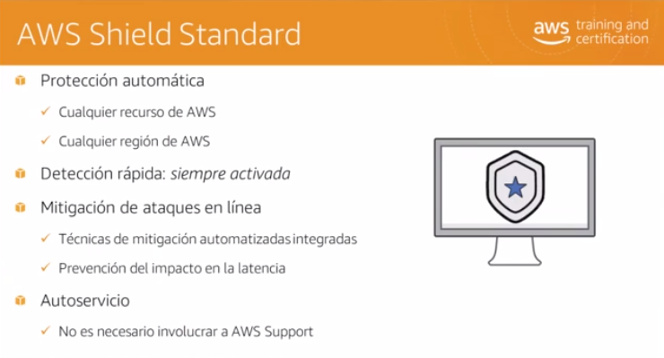

Ahora que conoce las características,resumamos los beneficios.

- AWS Shield proporciona integración e implementación directas. Con la opción estándar, sus recursos de AWS están automáticamente protegidos de los ataques DDoS más habituales, que suelen ocurrir en las capas de red y transporte. Puede conseguir un nivel superior de defensa si habilita AWS Shield Advanced a través de la práctica consola de administración o las API.
- Considere el valor de la protección personalizable. Con AWS Shield Advanced, dispone de flexibilidad para escribir reglas personalizadas a fin de mitigar ataques sofisticados en la capa de aplicación. Estas reglas se pueden implementar al instante, lo que le permite mitigar los ataques con rapidez. Puede configurar reglas de manera proactiva para bloquear automáticamente el tráfico sospechoso o responder a incidentes cuando ocurran. Además, el equipo de respuesta está disponible las 24 horas, todos los días para escribir reglas en su nombre.
- AWS Shield es rentable. Como cliente de AWS, la protección automática de la capa de red no requiere costo, recursos ni tiempo de inicio adicionales. Con la opción avanzada, se beneficia de la “protección de los costos de DDoS”, una característica que protege su factura de AWS de incrementos en el uso de EC2, ELB, Amzon CloudFront y Amazon Route 53 como resultado de un ataque DDoS.

Ahora analicemos el modo en que AWS Shield protege sus recursos.

AWS Shield Standard protege sus zonas alojadas de Amazon Route 53 contra ataques DDoS en la capa de infraestructura, incluidos los ataques de flejo o inundaciones SYN que se dirigen con frecuencia a su DNS.

Una variedad de técnicas, como las validaciones de encabezado y la configuración del tráfico basado en prioridades, mitigan automáticamente los ataques. 

El nivel avanzado proporciona un mayor aún mayor protección, visibilidad de ataques en su infraestructura de Route 53 y ayuda de nuestro equipo de respuesta para situaciones extremas.

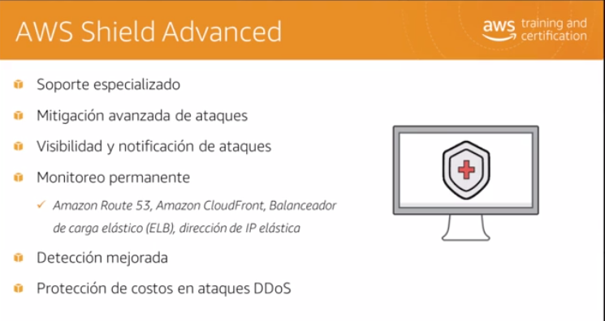

Cuando se utiliza Amazon CloudFront, AWS Shield Standard suministra protección integral contra ataques a la capa de infraestructura, como inundaciones SYN o UDP, u otros ataques de reflejo Los sistemas de mitigación y detección con funcionamiento constante eliminan automáticamente el tráfico sospechoso en las capas 3 y 4 para proteger su aplicación.

En los ataques a la capa de infraestructura en Amazon CloudFront, el 99% de los ataques detectados por AWS Shield Standard se mitigan automáticamente en menos de un segundo.

Con la suscripción avanzada, obtiene protección adicional en Amazon CloudFront. El equipo de respuesta aplica de forma activa todas las mitigaciones necesarias para los ataques sofisticados a las capas 3 ó 4 de la infraestructura mediante ingeniería de tráfico. Los ataques a la capa de aplicación, como inundaciones HTTP, también están protegidas.

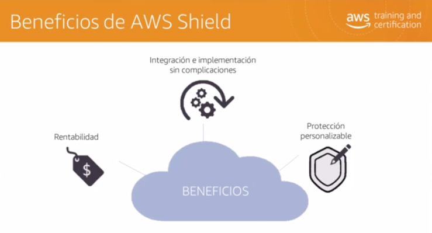

El sistema de detección siempre activo establece el tráfico de aplicaciones estable de los clientes y monitorea en busca de anomalías. Con AWS WAF, puede personalizar cualquier mitigación de la capa de aplicación.

Para otras aplicaciones personalizadas que no se basan en TCP (como UDP y SIP), no puede utilizar servicios como Amazon CloudFront o Elastic Load Balancing. En dichos casos, a menudo deberá ejecutar sus aplicaciones directamente en instancias de Amazon EC2 con conexión a Internet. 

La opción estándar protege su instancia de Amazon EC2 contra ataques comunes de las capas 3 y 4 de infraestructura, como aquellos desde flejo UDP que incluyen ataques de DNS, NTP y de reflexión SSDP. Las técnicas, como la definición del tráfico según la prioridad, se activan automáticamente cuando se detecta la marca bien definida de una ataque DDoS.

También puede obtener una protección avanzada contra ataques de DDoS de gran tamaño y sofisticados para estas aplicaciones mediante la activación de AWS Shield Advanced en la dirección IP elástica. La detección mejorada reconoce el modo automático el tipo de recurso de AWS y el tamaño de la instancia EC2, y aplica las mitigaciones predefinidas adecuadas.

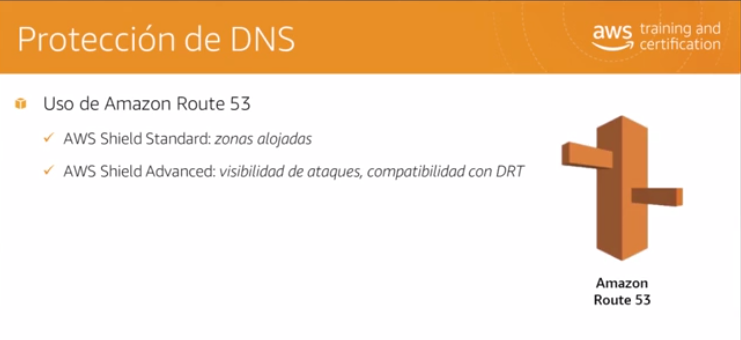

Puede crear perfiles de mitigación personalizados y, durante un ataque, todas las listas de control de acceso a redes (ACL) de Amazon VPC se refuerzan automáticamente en el límite de la red de AWS, lo que permite acceder a ancho de banda y capacidad de limpieza adicionales para mitigar ataques DDoS volumétricos de gran tamaño. El nivel avanzado también protege contra inundaciones SYN y otros vectores, como inundaciones UDP.

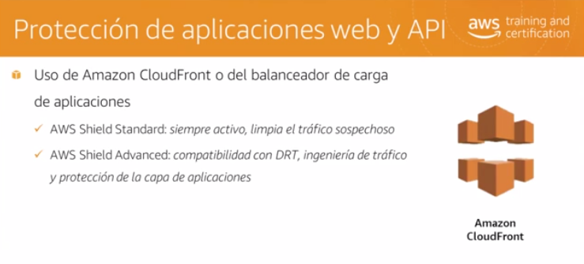

Terminemos con un resumen de todo lo que AWS Shield puede hacer por usted.

Ya sea que ejecuta varias aplicaciones web críticas en AWS y se quiere visibilidad y protección contra ataques más grandes y sofisticados, o que ejecuta una sola aplicación web en AWS y quiere protección contra ataques DDoS comunes, AWS  Shield puede ayudar. AWS Shield proporciona protección integrada y permanente contra ataques DDoS, y acceso a herramientas, servicios y experiencia para ayudarlo a proteger sus aplicaciones en AWS.

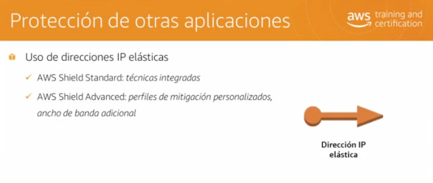

Más información visite: https://aws.amazon.com/shield