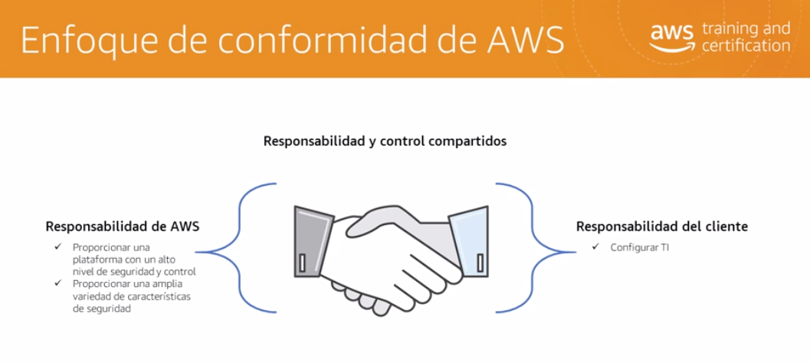
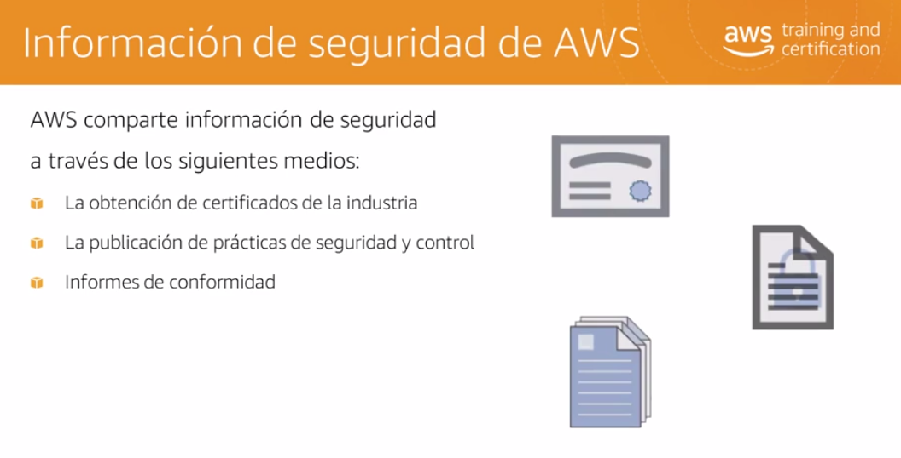
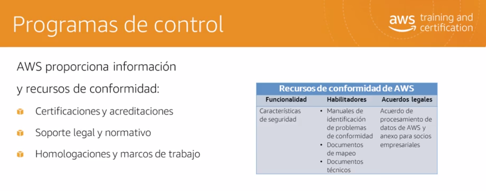
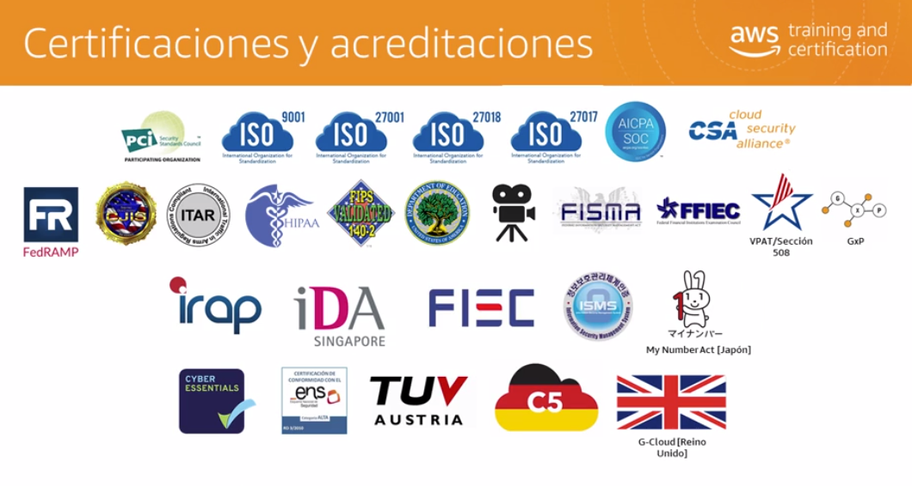
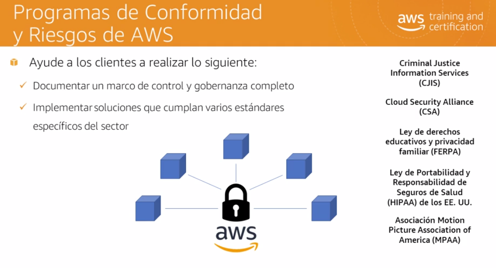
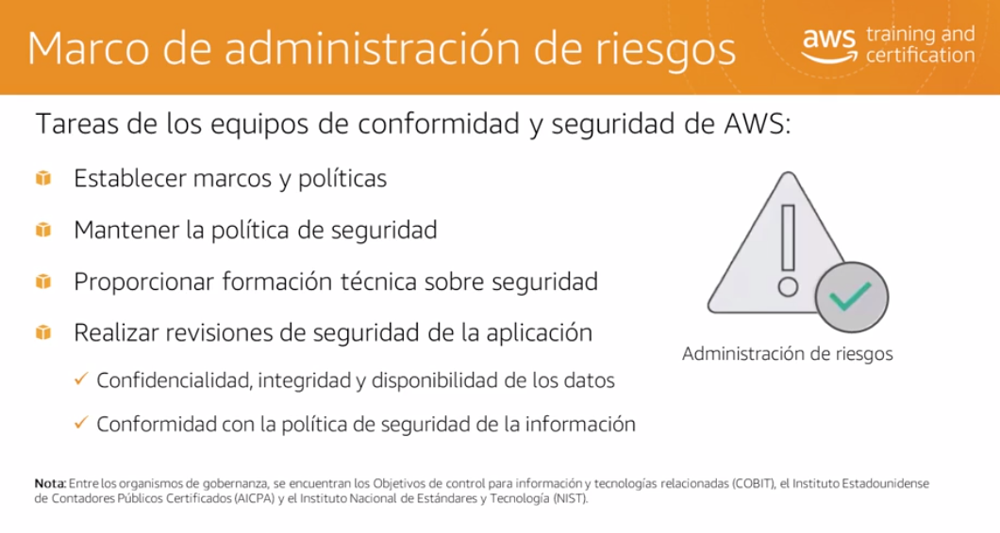
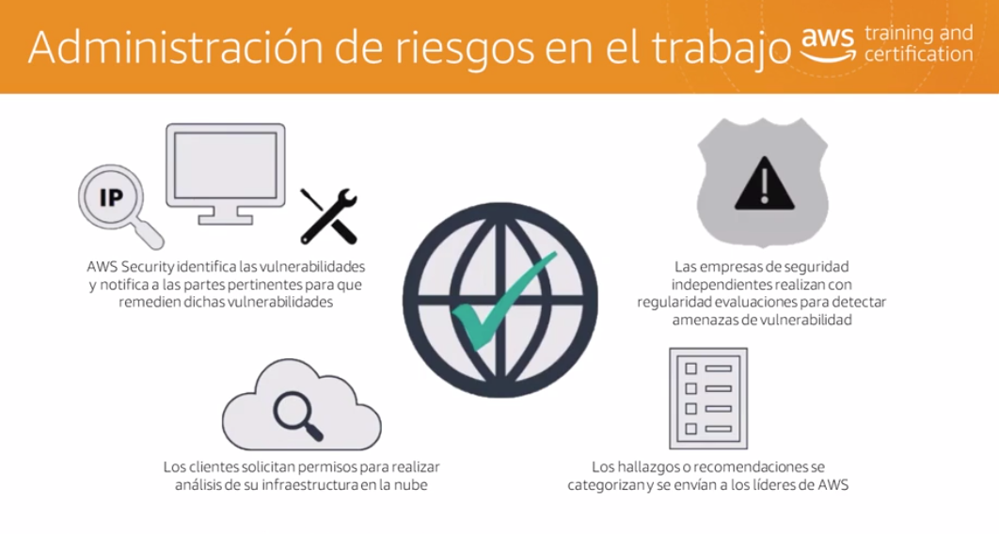
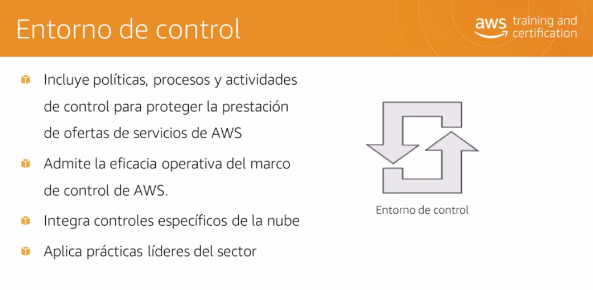
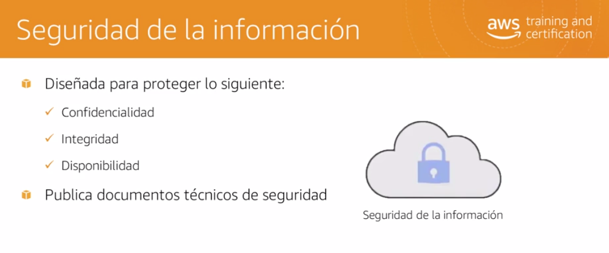
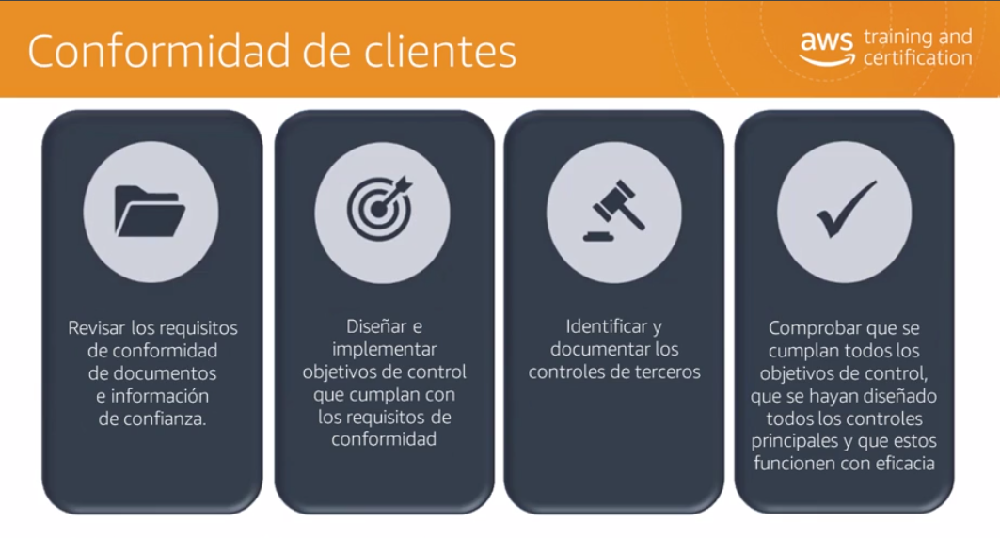

# Módulo 5 - Conformidad de seguridad 

Bienvenido a la conformidad de seguridad de AWS. ¿Cómo ayuda AWS a los clientes a mantener la seguridad y la conformidad en el entorno en la nube?

En Amazon, el éxito de nuestro programa de seguridad y conformidad se mide principalmente por una cosa: el éxito de nuestros clientes. Aproveche este esfuerzo para lograr los ahorros y la seguridad a gran escala que ofrece AWS a la vez que mantiene sólida la seguridad y cumple con la conformidad normativa. En este módulo, aprenderá sobre nuestro enfoque de conformidad, los programas de seguridad y riesgos, y de qué manera AWS puede proteger su negocio y ayudarlo a mantenerse actualizado sobre la curva de conformidad.

Como se muestra en el Modelo de responsabilidad de seguridad compartida, AWS y nuestros clientes se asocian para proteger la infraestructura. Compartimos el control del entorno de TI, lo que significa que ambas partes tienen la responsabilidad de administrar el entorno.

- Nuestra parte en esta responsabilidad compartida es proporcionar servicios valiosos en una plataforma controlada y con un alto nivel de seguridad, así como ofrece un amplio abanico de características de seguridad que los clientes pueden utilizar.
- Nuestros clientes son responsables de configurar los entornos de TI de manera controlada y segura de acuerdo con sus objetos empresariales.

Si bien los clientes no facilitan información a AWS sobre el uso y la configuración de los sistemas, informamos a los clientes sobre el entorno de control y seguridad que son pertinentes para las necesidades del negocio. Estos son nuestros métodos:

- Obtener certificaciones de la industria acreditaciones de terceros.
- Publicar información acerca de nuestras prácticas de seguridad y control en documentos técnicos y en el contenido del sitio web.
- Entregar certificados, informes y otra documentación directamente a los clientes conforme a los acuerdos de confidencialidad (o NDA), según se requiera.

Colaboramos con agentes de certificación externos y auditores independientes para ofrecer a los clientes información sobre las políticas de procesos y los controles.

- Un auditor de terceros independiente evalúa las prácticas de conformidad de AWS, lo cual tiene como resultado una certificación, un informe de auditoría o una acreditación de conformidad.
- Nuestros clientes son responsables de cumplir las leyes y regulaciones de conformidad. No obstante, en algunos casos, ofrecemos funcionalidad, habilitadores y acuerdos legales para respaldar la conformidad del cliente.
-  AWS respalda las homologaciones y marcos de conformidad que incluye requisitos de seguridad y conformidad publicados para sectores o funciones específicas. Proporcionamos características y habilidades de seguridad, como manuales de identificación de problemas de conformidad,  documentos de mapeo y documentos técnicos. 

AWS ha completado de modo concreto una serie de auditorías y cumple los estrictos requisitos legales y normativos, del sector tecnológico, del sector público y otros. Estas acreditaciones demuestran el compromiso con las necesidades, la satisfacción y la seguridad de nuestros clientes /y también de sus clientes). Dedique un momento a revisar nuestros avales.

Proporcionamos información sobre nuestros programas de riesgo y conformidad para que los clientes puedan incorporar los controles de AWS en su marco de gobernanza.

- Con esta información, se ayuda a los clientes a documentar un marco completo de control y gobernanza en el que AWS constituya una parte importante en dicho marco.
- La flexibilidad y el control que ofrece la plataforma de AWS permiten a los clientes  implementar soluciones que cumplen los estándares específicos de diferentes sectores.

Nuestro enfoque de conformidad incluye tres componentes:

- Administración de riesgos
- Entorno de control
- Seguridad de la información

La administración de AWS ha establecido un plan y un proceso empresariales estratégicos que sirven como base para la administración de riesgos. El plan empresarial, que se vuelve a evaluar al menos cada 2 años, es un proyecto para identificar y mitigar los riesgos.

El proceso de administración de riesgos requiere que la administración identifique los riesgos en sus ámbitos de responsabilidad e implemente las medidas correspondientes para abordarlos. Asimismo, el entorno de control de AWS está sujeto a varias evaluaciones de riesgos internas y externas.

Los equipos de conformidad y seguridad  de AWS han establecido un marco de políticas de seguridad de la información que se basan en directrices de organismos reguladores. 

AWS se atiene a la política de seguridad, ofrece formación técnica en seguridad a los empleados y realiza revisiones de la seguridad de las aplicaciones. En estas revisiones, se evalúa la confidencialidad, la integridad y la disponibilidad de datos, así como la conformidad con la política de seguridad de la información.

Analicemos la administración de riesgos de AWS en acción. 

- La seguridad de AWS analiza con regularidad todas las direcciones IP del punto de enlace de servicio expuestas a internet a fin de detectar vulnerabilidades. (Observe que los análisis no se llevan a cabo en las interfaces de instancias EC2 del cliente). 
- La seguridad de AWS  notifica al respecto a las partes afectadas para remediar todas las vulnerabilidades detectadas. Asimismo, empresas de seguridad independientes realizan con regularidad evaluaciones de amenazas de vulnerabilidad externas. Los resultados y las recomendaciones derivados de estas evaluaciones se clasifican y entregan al equipo directo de AWS.
- Es importante recordar que estos análisis se realizan a fin de proteger el estado y la viabilidad de la infraestructura subyacente de AWS, por lo que están pensados para reemplazar los análisis de vulnerabilidad que realizan los clientes y que resultan necesarios para satisfacer sus requisitos de conformidad específicos. Los clientes pueden solicitar permiso para realizar análisis de la infraestructura en la nube si se limitan a las instancias del cliente y no infringen la Política de uso aceptable de AWS.

AWS administra un entorno de control integral que comprende las políticas, los procesos y las actividades de control necesarios para entregar de forma segura al servicio de AWS.

El entorno de control colectivo comprende al personal, los procesos y la tecnología necesarios para crear y mantener un entorno que respalde la eficiencia operativa del marco de control de AWS.

En el marco de control, hemos integrado controles específicos de la nube identificados por las principales agencias del sector, y monitoreamos e identificamos activamente las prácticas líderes que ayudarán a nuestros clientes a administrar sus entornos de control.

AWS ha implementado un programa formal de seguridad de la información diseñado para proteger la confidencialidad, integridad y disponibilidad de los sistemas y datos de los clientes. Los clientes pueden acceder a un Documento técnico de seguridad en nuestro sitio web para obtener más información sobre el modo en que AWS puede ayudarlos a proteger los datos.

Los clientes de AWS deben mantener la gobernanza correspondiente de todo el entorno de control de TI, independientemente de cómo ella se implemente. Aquí se muestra el aspecto de un enfoque sólido de conformidad y gobernanza del cliente.

- El cliente revisa la información disponible en AWS y otras fuentes relevantes para comprender lo máximo posible el entorno de TI. Luego documenta todos los requisitos de conformidad.
- A continuación el cliente diseña e implementa objetivos de control para cumplir los requisitos empresariales en materia de conformidad.
- El cliente identifica y documenta los controles con propiedad de terceros.
- Por último, el cliente comprueba que se cumplen todos los objetivos de control y que todos los controles principales se diseñaron y funcionan con eficacia.

Cuando interactúan con AWS en el proceso de conformidad y gobernanza, los clientes pueden diseñar de acuerdo con los requisitos de conformidad.

Terminemos con un resumen de lo que los programas de conformidad pueden hacer por su negocio. A medida que se crean sistemas en la infraestructura de la nube, se comparten las responsabilidades de conformidad.

- Nuestro programa ayuda a los clientes a comprender  los estrictos controles vigentes en AWS para proteger los datos en la nube. 
- Los habilitadores de conformidad de AWS vinculan características de servicio fáciles de utilizar para auditorías, así como regulaciones y estándares de seguridad orientados a ayudar a los clientes a crear sobre programas tradicionales.  A su vez, nuestros clientes pueden establecer un entorno de control de seguridad de AWS y operar en él.

Para obtener más información,visite: https://aws.amazon.com/es/compliance