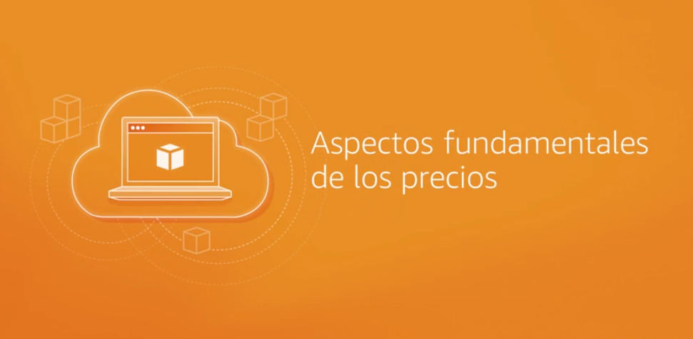
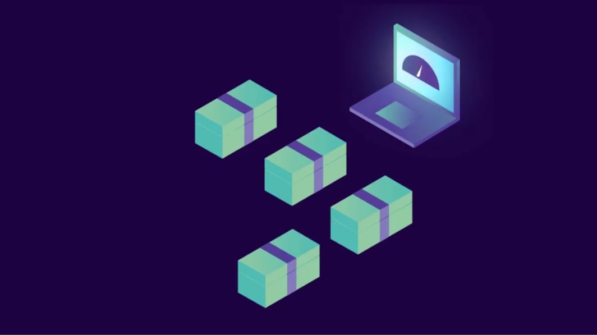

# Módulo 6 - Aspectos fundamentales de los precios

Precios y soporte. El módulo final de Cloud Practitioner Essentials se centra en los precios de la nube de AWS. Comienza con una introducción general a nuestra filosofía de precios. Además, cubre las características de precios reales de muchas de nuestras ofertas principales y algunas herramientas que hemos desarrollado para ayudarlo a controlar sus costos y garantizarle la obtención de una buena relación calidad-precio.

Con AWS sólo paga por los servicios individuales que necesita durante el tiempo en que los utilice, sin tener que suscribir contratos a largo plazo o licencias complejas. Pagar por los servicios de AWS es como pagar por servicios públicos, como agua y electricidad: sólo paga por los servicios que consume. Una vez que deja de utilizarlos, no hay costos adicionales o tarifas de cancelación.

AWS ofrece una variedad de servicios de informática en la nube. Sólo paga por la cantidad exacta de recursos que realmente utiliza de cada uno de los servicios. Con la AWS puede hacer lo siguiente:

- Pagar por uso
- Pagar menos al reservar
- Pagar aún menos por una unidad cuanto más utiliza
- Pagar aún menos a medida que AWS crece

Examinemos estos conceptos básicos en mayor profundidad, Con AWS, no tiene que dedicar recursos valiosos a la creación de infraestructura mediante, por ejemplo, la compra de servidores o el alquiler de instalaciones. AWS le permite reemplazar grandes gastos iniciales por costos variables más bajos y le ofrece la flexibilidad necesaria para obtener los servicios que necesita bajo demanda.

Los precios de pago por uso le permiten adaptarse con facilidad a las cambiantes necesidades de negocios sin comprometerse a dedicar presupuestos excesivos y mejorando la capacidad de respuesta ante los cambios. Con el modelo de pago por uso, puede adaptar la infraestructura en función de las necesidades y no de las previsiones, lo que reduce el riesgo de aprovisionamiento excesivo o de capacidad insuficiente como para satisfacer sus necesidades.

Cuando pagan por los servicios según los necesita, puede concentrarse en innovar e inventar, reducir la complejidad de aprovisionamiento y aportar total elasticidad a su negocio.

Para determinados servicios, como Amazon EC2 y Amazon RDS, puede invertir en **capacidad reservada**. Con las instancias reservadas, puede ahorrar hasta 75% en comparación con la capacidad bajo demanda equivalente. Las instancias reservadas se encuentran disponibles en tres opciones: 

- Pago inicial completo (AURI)
- Pago inicial parcial (PURI) 
- Sin pago inicial (NURI)

Si adquiere instancias reservadas, cuanto mayor es el pago inicial, mayor es el descuento. Para maximizar el ahorro, puede efectuar un pago inicial completo y recibir el mayor descuento. La opción PURI ofrece descuentos más bajos, pero se quiere menos gastos iniciales. Por último, puede elegir no realizar pagos iniciales y aún así recibir un pequeño descuento. Con la capacidad reservada, su organización puede minimizar los riesgos, administrar los presupuestos con mayor flexibilidad y cumplir con las políticas que exigen compromisos a un plazo más largo.

Los servicios de almacenamiento de AWS, en particular, pueden ayudarlo a deducir los costos. Para optimizar el ahorro, elija las combinaciones adecuadas de soluciones de almacenamiento que lo ayudan a reducir los precios y, al mismo tiempo, aumentar el rendimiento, la seguridad y la durabilidad. Por ejemplo, en servicios como Amazon S3 y la transferencia de datos de **salida** de Amazon EC2 , los precios se dividen a niveles, por lo que cuanto más utilice menos pagará por gigabyte. Además, la transferencia de datos **entrante** es siempre gratuita. Cómo resultado, a medida que se  incrementan sus necesidades de uso de AWS, se beneficiará de las economías de escala que le permiten aumentar la adopción y mantener los costos bajo control.

Si ninguno de los modelos de precios de AWS se aplica a su proyecto, cuenta con precios personalizados disponibles para proyectos de gran volumen y requisitos únicos. 

AWS también ofrece una capa de uso gratuita para los clientes nuevos, que pueden ejecutar una microinstancia de Amazon EC2 gratuita durante 1 año. Los servicios como Amazon S3, Amazon Elastic Block Store (Amazon ESB), Elastic Load Balancing(ELB), la transferencia de datos de AWS y otros servicios también ofrecen una capa de uso gratuita.

Si tiene varias cuentas de AWS, puede consolidar el uso de AWS mediante la Facturación Unificada y obtener beneficios por niveles de función del uso total entre sus cuentas.

Mientras que la cantidad y los tipos de servicios de AWS han aumentado de forma considerable, nuestra filosofía de precios no ha cambiado. Al final de cada mes, paga sólo por la por lo que utiliza y puede comenzar a utilizar un producto o dejar de hacerlo en cualquier momento, sin contratos a largo plazo. Para obtener más información sobre los precios, consulte: https://aws.amazon.com/es/pricing 