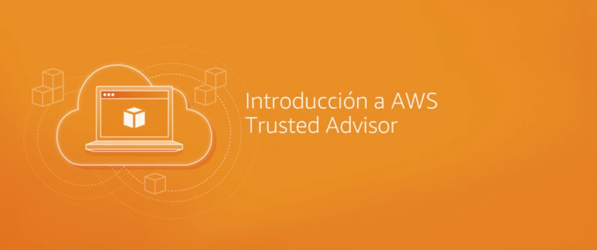
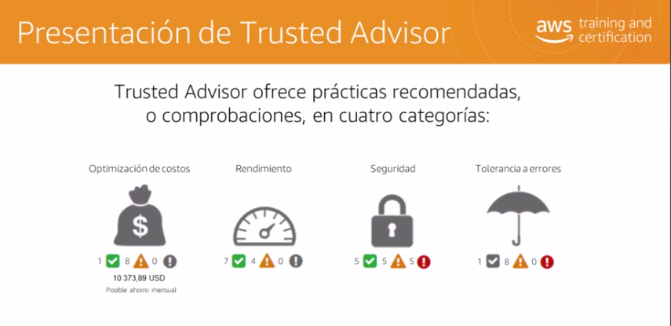
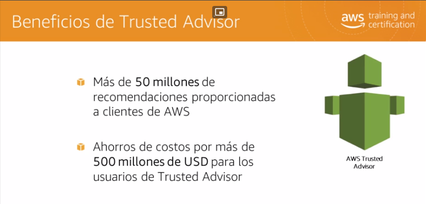
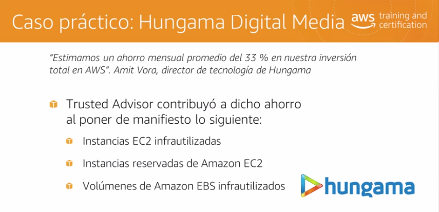
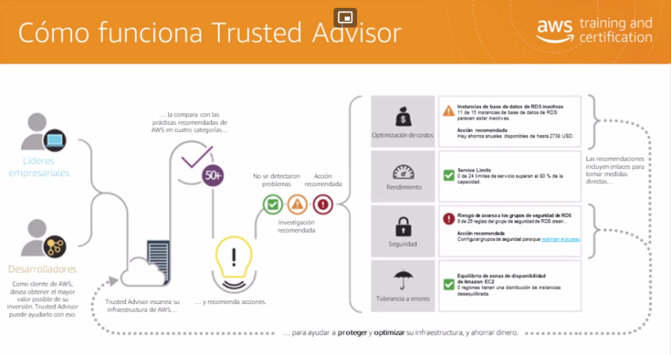
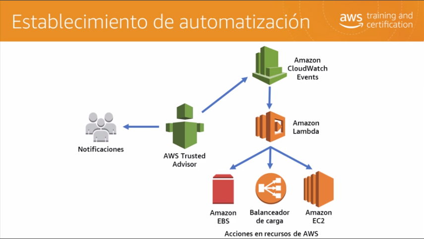

# Módulo 6 - AWS Trusted Advisor

Cuando comienza su recorrido en AWS, es posible realizar un seguimiento de los recursos, pero las necesidades aumentan rápidamente. Y a medida que aumentan las necesidades, las cuentas de AWS pueden tener demasiados recursos para realizar el seguimiento. Puede tener recursos huérfanos, recursos que no están optimizados y términos de costos y sólo están ahí, como direcciones IP elásticas no asociadas a instancias, o volúmenes o instantáneas que no se utilizan y que sólo desperdician dinero. Además también puede tener recursos que no están optimizados para la tolerancia a errores, el rendimiento o la seguridad. Todas estas cosas son importantes, pero es difícil realizar un seguimiento debido a la complejidad. Entonces, aquí tiene estos recursos que aumentan y, a medida que aumentan necesita algo para realizar un seguimiento de ellos.

Ahí es donde entra en juego Trusted Advisor. Trusted Advisor es una herramienta que ofrece las prácticas recomendadas y comprueba todos los recursos de su cuenta para ver si concuerdan con dichas prácticas. Y lo hace en cuatro categorías diferentes:

- Seguridad 
- Tolerancia a errores 
- Rendimiento 
- Optimización de costos

Este es un panel de consola de Trusted Advisor. Esto demuestra que puedo ahorrar mucho dinero ahora mismo si hago las cosas correctas, como puede ver allí. Además existen tres categorías diferentes de comprobaciones:

- Rojo, que indica que se requiere una acción inmediata
- Amarillo, que indica que se requiere su investigación 
- Verde, que indica que todo está bien y usted es lo máximo

Hasta la fecha, Trusted Advisor ha ahorrado más de 500 millones USD en costos para los clientes y ha ofrecido más de 15 millones de recomendaciones a los clientes. Ahora que conoce un poco más sobre Trusted Advisor, veamos un caso práctico rápido de un cliente para ofrecerle un ejemplo concreto de cómo se ha utilizado el servicio en el pasado.

Hungama es uno de los clientes de AWS que ha logrado ahorrar más del 23% en costos mensuales. Utilizaron varias comprobaciones, especialmente la comprobación de instancias EC2 infrautilizadas, en la que algunos de sus equipos de desarrollo estaban provisionados en exceso en términos de tamaños de instancias. Necesitaban ajustar sus instancias a un tamaño adecuado y eliminar el desperdicio de instancias sin utilizar.

Además de la comprobación de la instancia de Amazon EC2 infrautilizada, también utilizaron las comprobaciones de instancias reservadas de Amazon EC2 y de volumen de EBS infrautilizado para asegurarse de que utilizaban los recursos de manera óptima y ahorraban costos.

¿Cómo funciona exactamente Trusted Advisor? Trusted Advisor compara los recursos de su cuenta con las prácticas recomendadas establecidas y expone datos en forma de comprobaciones. 

Trusted Advisor no solo muestra estas prácticas recomendadas en forma de consola, sino que también dispone de una API. Además, puede recibir notificaciones de comprobaciones  específicas cuando se producen errores para realizar acciones en ellas.
También puede incorporar la automatización porque Trusted Advisor está integrado a Amazon CloudWatch Events, que permite utilizar servicios como AWS Lambda para automatizar la optimización de sus recursos y otras acciones.

